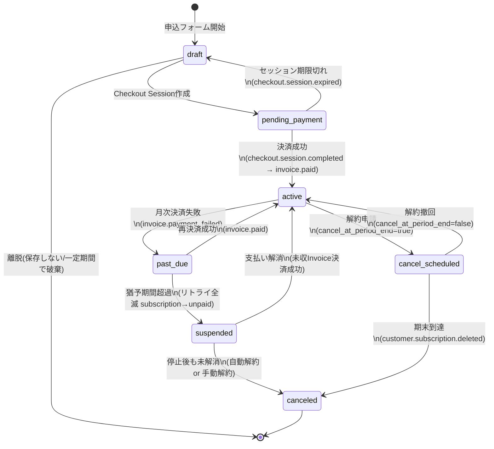

# 15. Stripe Sales & Billing Design — 販売・契約・課金の詳細設計（SALES-0）

このドキュメントは、[14_Sales_And_Billing_Policy.md](14_Sales_And_Billing_Policy.md)（販売方針の正本）を **Stripeで安全に実装するための正式設計** です。SALES-0（2026-07-28・代表決定）で制定しました。

- **本書は設計のみ。コード・マイグレーション・Stripeダッシュボード操作は一切含まない。**
- 実装は SALES-1 以降で、各工程ごとに代表承認を得てから着手する。
- 方針レベル（何を・いくらで・いつ請求するか）は14番が正本。実装レベル（Stripeのどのオブジェクトで・どの状態遷移で実現するか）は**本書が正本**。

---

## 1. 確定仕様の要約（SALES-0 代表決定）

| 項目 | 確定内容 |
|---|---|
| 初期設定費 | 10,000円（税抜・1回） |
| 基本料金 | 20,000円／月（税抜・**管理者1名込み**） |
| 追加ユーザー | 3,000円／月・1名（税抜）※Webサイト上の表記は「追加アカウント」（同一のもの。→9-4） |
| 利用開始 | 申込 → **カード決済成功** → 利用開始 |
| 初回請求 | **利用開始月の日割りのみ**（翌月分をまとめて決済する方式は廃止。14番v1.0からの変更→2-4） |
| 月次課金 | 毎月1日に当月分をStripe自動決済（前払い） |
| キャンペーン | 創業記念キャンペーン＝初期設定費無料＋**基本料金1か月分無料（基本料金のみ対象・追加ユーザー料金は対象外・確定）**・先着50社・カード登録必須 |
| 紹介コード | 正式採用。**割引なし・計測のみ** |

---

## 2. 請求サイクル設計

### 2-1. 請求タイムライン（通常契約）

```
申込日(例: 8/20)                9/1              10/1
  │                              │                │
  ├─ 決済① 日割り基本料金        ├─ 決済② 9月分   ├─ 決済③ 10月分
  │   (8/20〜8/31分)             │   (満額)       │   (満額)
  │   ＋追加ユーザー日割り分      │                │
  └─ 利用開始                    └─ 以後、毎月1日に当月分を自動決済(前払い)
```

- 請求日は「**利用開始日（日割り）**」と「**以後の毎月1日**」の2種類のみ。
- 「翌々月以降は毎月1日」という従来表現は、正確には**翌月1日から毎月1日**である（キャンペーン適用時は翌月1日の請求額の基本料金部分が0円になるだけで、請求イベント自体は翌月1日から発生する）。

### 2-2. 請求タイムライン（創業記念キャンペーン適用時）

```
申込日(例: 8/20)                9/1                     10/1
  │                              │                       │
  ├─ 決済① 日割り基本料金        ├─ 請求② 基本料金 0円   ├─ 決済③ 10月分
  │   (初期設定費は請求しない)    │   ＋追加ユーザーは満額 │   (通常課金)
  └─ 利用開始                    │   (0円なら決済なし)    └─ 以後通常
```

- 初期設定費: **請求自体を発生させない**（申込時にキャンペーン適用が確定した時点で請求対象から除外）。
- 基本料金1か月分無料: **最初の「満額請求月」（＝利用開始の翌月）の基本料金部分**に適用する。日割り月には適用しない（代表決定の請求例: 8/20開始 → 8月は日割り請求・9月分が無料・10/1から通常）。
- 追加ユーザー料金は**無料対象外（確定）**。翌月1日の請求は「基本料金0円＋追加ユーザー n×3,000円」となる。追加ユーザー0名なら請求額0円（0円インボイスは決済なしで確定）。

### 2-3. 日割りの計算方式

| 論点 | 設計 |
|---|---|
| 計算単位 | Stripeのproration（期間按分）に委ねる。Stripeは**秒単位の期間比**で按分し、円未満は自動処理される |
| 「日割り」表記との整合 | 利用開始日0時〜月末で按分すれば実質日割りと一致する。申込時刻によって数十円程度の差が出る「時刻割り」になる点に注意（→9-1 代表判断） |
| 自前計算する代替案 | 日単位（暦日÷当月日数・円未満切り捨て）を自前計算し、Stripeへは確定金額のInvoice Itemとして渡す方式。表示と請求が1円単位で一致するが、実装・検証コストが増える |
| 推奨 | **Stripe標準prorationを採用**（実装が単純・Stripe側の監査証跡と一致）。申込画面には「初回のお支払い額」を**Stripeの見積りAPI（upcoming invoice preview）で取得した確定額**で表示し、「日割り計算の概算」を自前表示しない（ズレを構造的に防ぐ） |

### 2-4. 14番v1.0からの変更点（重要）

14番v1.0の「翌月分も利用開始時にまとめて決済する方式を基本とする」は、SALES-0の代表決定「**初回請求は利用開始月の日割りのみ**」により**廃止**。14番はv2.0で更新済み。`website-v2/apply.html` の「翌々月以降は毎月1日に自動決済」という文言は「翌月1日から毎月1日」へ**Web側の軽微修正が必要**（SALES-1で実施。→9-5）。

---

## 3. Stripeオブジェクト設計

### 3-1. Product / Price

| Stripeオブジェクト | ID(lookup_key案) | 内容 |
|---|---|---|
| Product | `slw_lite_base` | Smart Labo Works ライト 基本料金（管理者1名込み） |
| Product | `slw_lite_user` | 追加ユーザー |
| Product | `slw_setup_fee` | 初期設定費 |
| Price | `slw_lite_base_monthly_v1` | 20,000 JPY / month / recurring / `tax_behavior: exclusive` |
| Price | `slw_lite_user_monthly_v1` | 3,000 JPY / month / recurring / 数量課金（quantity=追加ユーザー数） / `tax_behavior: exclusive` |
| Price | `slw_setup_fee_v1` | 10,000 JPY / one_time / `tax_behavior: exclusive` |

- **価格改定はPriceの新規作成（`_v2`）で行い、既存Priceは変更しない**（Stripeの原則。既存契約は旧Priceのまま、移行は別途判断）。
- 消費税: 税抜価格で登録し、税は請求時に加算する。**手動Tax Rate（10%・exclusive）を全Invoiceに適用**する方式を第一案とする（Stripe Tax自動計算は従量課金コストが掛かるため。→9-2 代表判断）。

### 3-2. Customer / Subscription

| 項目 | 設計 |
|---|---|
| Customer | **1社=1 Customer**。`metadata.company_id` で自社DBと双方向に紐づけ。メールは会社の請求先メール |
| Subscription | **1社=1 Subscription**。items = base(quantity 1) + user(quantity n)。追加ユーザーの増減は items の quantity 変更（→2-3と同じproration方針、ただし**月途中の追加は日割り課金・削減は返金せず翌月から反映**を第一案とする →9-3） |
| 請求アンカー | `billing_cycle_anchor` = 翌月1日 0:00 **JST**。これにより初回Invoiceが自動的に「開始日〜月末」の按分になり、以後毎月1日請求になる（StripeはUTC管理のため、JST 1日0:00 = UTC前月末15:00のタイムスタンプを渡す） |
| 決済方法 | カードのみ。`payment_settings.payment_method_types = ['card']` |
| 回収方式 | `collection_method: charge_automatically`（自動決済・前払い） |

### 3-3. 申込フロー（Stripe Checkout）

```
申込画面(会社情報→人数→コード入力→確認)
  ↓ サーバーが Checkout Session を作成 (mode: subscription)
Stripe Checkout(カード入力・Stripeホスト画面 = カード情報非保持)
  ↓ 決済成功
checkout.session.completed Webhook
  ↓
契約レコード確定 → 会社アカウント自動作成(SALES-5) → AI初期設定ウィザード(SALES-6)
```

- **Checkout Session（Stripeホスト型）を採用**。自社サーバー・自社DBはカード番号に一切触れない（PCI DSS SAQ-A相当）。
- line_items: base（recurring）＋ user×n（recurring）＋ **初期設定費（one_time。subscriptionモードのCheckoutでは初回Invoiceに合算される)**。キャンペーン適用時は初期設定費line_item自体を入れない。
- `allow_promotion_codes: true` でキャンペーンコード入力欄をStripe側でも受ける、または自社画面で事前検証してSessionに `discounts` を渡す（自社画面で入力→検証→Sessionへ、を第一案とする。UXが2導線にならない）。
- 紹介コードは**Stripeに渡さない**（割引なし・計測のみ）。自社DBに保存し、`metadata.referral_code` としてSubscriptionにも記録する（Stripe側からも突合できるように）。
- 契約前の表示義務: Checkout直前の自社確認画面で「初回決済額（日割り・Stripe見積りAPIの確定額）」「次回決済日（翌月1日）と金額」「キャンペーン適用内容」を表示する（14番の確定事項）。

### 3-4. キャンペーンの実装（Coupon / Promotion Code）

| Stripeオブジェクト | 設計 |
|---|---|
| Coupon `founding_1mo_free` | **100% off・`applies_to.products: [slw_lite_base]`**（基本料金のみに効く。追加ユーザーは対象外＝確定仕様をStripeの仕組みで強制） |
| Promotion Code | Couponに紐づくコード（例: `START2026`）。**`max_redemptions: 50` で「先着50社」をStripe側で強制**（51社目は適用エラー）。`expires_at` で期間終了を設定。コード文字列の追加発行・無効化はPromotion Code単位で管理 |

**「翌月の基本料金だけを無料にする」実現方式（重要設計点）:**

Couponを申込時にそのまま適用すると**初回の日割りInvoiceが割引されてしまい**、代表決定（日割りは請求・翌月分が無料）と一致しない。次の2案を比較し、**案Aを推奨**する。

| 案 | 方式 | 長所 | 短所 |
|---|---|---|---|
| **案A（推奨）: Subscription Schedule の3フェーズ** | phase1: 開始日〜当月末（割引なし・日割り請求）／ phase2: 翌月1日〜翌々月1日（`discounts: founding_1mo_free`）／ phase3: 以後（割引なし） | 宣言的で、Webhookのタイミング競合がない。請求プレビューも正確に出る。キャンペーン内容がSchedule定義として監査できる | Subscription単体よりオブジェクトが1つ増える（Schedule管理） |
| 案B: Webhook後付け | 通常Subscriptionで開始し、初回`invoice.paid`受信時にCoupon（duration: once）をSubscriptionへ付与 → 次回（翌月1日）Invoiceだけ割引 → 自動で失効 | オブジェクト構成が単純 | Webhook遅延・二重配信・失敗時に「無料が適用されない/二重適用」事故の余地。リカバリ処理が必要 |

- 初期設定費無料は上記と独立に「line_itemを入れない」だけで完結する。
- **先着50社の判定基準**: Stripe Promotion Codeの redemption 消費時点＝**Checkout決済成功時**（＝契約成立時）とする。「申込画面到達順」ではない（→9-6 代表判断として明記）。

### 3-5. Invoice

| 項目 | 設計 |
|---|---|
| 生成 | Subscription/Scheduleから自動生成。手動Invoiceは使わない |
| 決済失敗時 | Stripe Smart Retries（自動リトライ）を有効化（→6章） |
| 0円Invoice | キャンペーン月・追加ユーザー0名の場合に発生。決済は走らず`paid`(amount 0)で確定する。契約状態はactiveのまま |
| 領収書・請求書 | Stripeのinvoice PDF/receiptを顧客ポータル（Stripe Billing Portal）で提供する案を第一案とする（自前実装しない） |
| 適格請求書(インボイス制度) | Stripe Invoiceに登録番号(T番号)を表示する設定が必要。**当社の適格請求書発行事業者登録の有無が未確認**（→9-7 代表判断） |

---

## 4. 契約状態とライフサイクル

### 4-1. 正式な契約状態（自社DB `contracts.status`）

| 状態 | 意味 | Stripe対応物 |
|---|---|---|
| `draft` | 申込中（申込フォーム入力中・Checkout未作成） | ―（自社のみ） |
| `pending_payment` | 決済待ち（Checkout Session作成済み・未決済） | checkout.session(open) / subscription(incomplete) |
| `active` | 契約中（利用可能） | subscription: active |
| `past_due` | 支払い失敗・再決済中（利用は継続） | subscription: past_due |
| `suspended` | 停止（猶予超過・ログイン不可。契約は未解約） | subscription: unpaid（回収停止・請求は保留） |
| `cancel_scheduled` | 解約予約（当月末まで利用可） | subscription: active + `cancel_at_period_end: true` |
| `canceled` | 解約済（利用不可・再開は新規契約） | subscription: canceled |

### 4-2. 状態遷移図



- 状態の正は**Stripeイベントで駆動して自社DBへ反映**する（自社で勝手に遷移させない）。手動運用（例: 特別対応での停止解除）は管理操作として `contract_events` に記録する。
- `suspended`（アクセス遮断）はStripeには存在しない自社概念。`subscription: unpaid` への遷移と猶予日数（→6章）で制御する。

---

## 5. DB設計（今回追加が必要な分のみ・マイグレーションは作らない）

前提: 会社・ユーザーは `smartlabo-works` 側の既存構造（Company / User）を使う。ここでは**課金のために追加が必要なテーブルだけ**を定義する。

```
contracts（契約）
  id                        PK
  company_id                FK → companies（1社1契約: UNIQUE）
  plan_code                 TEXT ('lite')
  status                    TEXT (4-1の7状態)
  user_quantity             INT  (追加ユーザー数。管理者1名は含まない)
  stripe_customer_id        TEXT UNIQUE
  stripe_subscription_id    TEXT UNIQUE NULL
  stripe_schedule_id        TEXT NULL (キャンペーン適用時のSubscription Schedule)
  campaign_id               FK NULL → campaigns
  referral_code_id          FK NULL → referral_codes
  started_at                DATETIME NULL (決済成功=利用開始日時)
  current_period_start/end  DATETIME NULL (Stripeから同期)
  cancel_at                 DATETIME NULL (解約予約日=期末)
  canceled_at               DATETIME NULL
  suspended_at              DATETIME NULL
  created_at / updated_at

campaigns（キャンペーン。14番の管理項目に対応）
  id, name('創業記念キャンペーン'),
  stripe_coupon_id, discount_desc('初期設定費無料+基本料金1か月分無料'),
  waive_setup_fee BOOL, free_months INT,
  starts_at, ends_at, max_redemptions INT(50),
  target_plan TEXT('lite'), requires_card BOOL(true),
  is_active BOOL, created_at / updated_at
  ※残り枠・適用企業数はDBに持たず、Stripe Promotion Codeのredemption数を正とする
    (表示用キャッシュを持つ場合も「Stripeが正」を明記)

campaign_codes（キャンペーンコード。1キャンペーンに複数コード発行可）
  id, campaign_id FK, code TEXT UNIQUE('START2026'等),
  stripe_promotion_code_id TEXT UNIQUE,
  is_active BOOL, expires_at NULL, created_at

referral_codes（紹介コード。割引なし・計測のみ）
  id, code TEXT UNIQUE('AGENT-TOTTORI'等),
  owner_type TEXT('agency'|'sns'|'staff'|'other'),
  owner_name TEXT, is_active BOOL, memo TEXT, created_at
  ※Stripeオブジェクトは作らない。Subscription metadataにもコピーする

stripe_webhook_events（冪等性の担保）
  id, stripe_event_id TEXT UNIQUE, event_type TEXT,
  status TEXT('received'|'processed'|'failed'|'skipped'),
  error TEXT NULL, received_at, processed_at NULL
  ※同一event_idの二重処理を防ぐ。失敗はリトライ対象

contract_events（契約の監査ログ・追記型）
  id, contract_id FK, event_type TEXT(状態遷移・手動操作・コード適用等),
  actor TEXT('stripe_webhook'|'admin:<name>'|'system'),
  stripe_event_id TEXT NULL, detail TEXT(JSON), created_at

invoices_mirror（StripeInvoiceの参照キャッシュ・会計/画面表示用）
  id, contract_id FK, stripe_invoice_id TEXT UNIQUE,
  period_start, period_end, subtotal, tax, total, status,
  paid_at NULL, hosted_invoice_url TEXT, created_at / updated_at
  ※金額・状態の正は常にStripe。突合レポートで乖離検知する
```

**関連図:** companies 1—1 contracts ／ contracts n—1 campaigns ／ campaigns 1—n campaign_codes ／ contracts n—1 referral_codes ／ contracts 1—n contract_events ／ contracts 1—n invoices_mirror

**設計原則:** カード番号・有効期限・セキュリティコードは**いかなる形でも自社DBに保存しない**（StripeのCustomer/PaymentMethodのみ）。自社DBは「契約状態のミラー＋監査ログ」であり、金額・残枠・決済状態の正は常にStripe。

---

## 6. 解約・支払い失敗の仕様

### 6-1. 解約（顧客都合）

| 論点 | 第一案（代表確認が必要 →9章） |
|---|---|
| いつ終了するか | **当月末**（`cancel_at_period_end: true`）。前払い済みの当月分は月末まで利用可 |
| 日割り返金 | **しない**（前払い・月単位契約のため。返金なしを利用規約へ明記する必要 →7章） |
| 解約予約の撤回 | 期末到達前なら可（`cancel_at_period_end: false` に戻す） |
| データの扱い | 解約後のデータ保持期間・削除手順は本設計の範囲外（SALES-5/法務と合わせて確定） |
| 初期設定費 | 解約時も返金しない（1回限りの役務対価） |

### 6-2. カード決済失敗時

| 段階 | 設計 |
|---|---|
| 自動再試行 | **Stripe Smart Retries を有効化**（成功率が最も高いタイミングでStripeが自動再決済。設定上限: 最大4回・約3週間） |
| 顧客通知 | 失敗の都度メール通知（Stripeの標準通知＋自社通知の要否はSALES-2で確定） |
| カード更新 | Stripe Billing Portalで顧客自身がカード差し替え → 未収Invoiceへ自動再決済 |
| 猶予期間 | **14日**（この間 `past_due`・利用は継続）を第一案とする |
| 停止 | 猶予超過で `suspended`（ログイン不可・データは保持）。Stripe側はリトライ終了後 `unpaid`（請求は保留のまま） |
| 自動解約 | 停止からさらに**30日**未解消で `canceled` とする案（第一案）。それまでは支払い解消で即復帰可 |

猶予14日・停止後30日はいずれも**提案値**であり、代表決定が必要（→9章）。

---

## 7. 法務確認事項（セルフ申込・Stripe決済に必要な追加分）

**本文の変更は行っていない。** WEB-V2-8レビュー（[WEB_V2_8_SALES_MODEL_AND_CONVERSION.md](../docs/reviews/WEB_V2_8_SALES_MODEL_AND_CONVERSION.md) 第17節）の15項目に、Stripe設計で確定が必要になった以下を**追加**する。

**利用規約（追記候補）**
1. 契約成立時点の定義: 「Checkout決済成功時」とする（本設計4-1の`active`遷移と一致させる）
2. 解約: 当月末終了・日割り返金なし・解約予約と撤回の手順
3. 支払い失敗時の措置: 再決済・猶予期間・利用停止・自動解約（6章の日数を規約に反映）
4. 料金改定時の通知方法と適用時期（Price `_v2` 移行の根拠になる条項）
5. 0円請求月（キャンペーン）にも契約が継続している旨

**特定商取引法に基づく表記（ページ新設が必須）**
6. 支払方法「クレジットカード（Stripe）」・支払時期「申込時（日割り）および毎月1日（前払い）」・役務提供時期「決済完了後直ちに」
7. 解約条件（当月末・返金なし）の明記
8. 事業者名・代表者・所在地・連絡先 — **所在地・電話番号は現在ホームページ非掲載方針のため、特商法の表示義務との整合を専門家確認**（WEB-V2-8から持ち越し・未解決）
9. 税込総額表示の要否（現在は税抜表示のみ）— 専門家確認（持ち越し・未解決）

**プライバシーポリシー（追記候補）**
10. 決済情報の取り扱い: カード情報はStripe社が取得し当社サーバーは保持しないこと・Stripe社への個人情報提供（氏名・メール・請求情報）
11. 紹介コード・キャンペーンコードによる流入計測データの取得目的

**キャンペーン規約（新規作成が必須）**
12. 「基本料金1か月分無料」の正確な定義（利用開始翌月の基本料金部分・追加ユーザー対象外＝**今回確定**）
13. 先着50社の判定基準（決済成功順＝Promotion Code redemption順）と終了告知の方法
14. カード登録必須・適用は1社1回・他キャンペーンとの併用可否（併用不可を第一案）
15. 不正利用（コードの転売・複数申込等）時の適用取消

**インボイス制度（新規）**
16. 適格請求書発行事業者の登録有無と、Stripe Invoiceへの登録番号(T番号)表示設定（→9-7）

---

## 8. SALES-1（セルフ申し込み画面実装）着手の前提条件

1. 本設計（SALES-0）の代表承認
2. 9章の代表判断事項の決定（特に 9-1 日割り方式・9-2 税計算・6章の解約/猶予日数）
3. 特商法表記ページ・キャンペーン規約の整備方針決定（公開前必須。実装と並行可だが**公開はこれらが揃うまで不可**）
4. Stripeアカウントの開設・本人確認（法人情報・銀行口座）— 代表の作業
5. 実装リポジトリの確定: 申込画面・Webhook受信は `smartlabo-works`／`smartlabo-platform` のどちらに置くか（本リポジトリはGitHub Pages静的サイトのためサーバー処理を置けない →9-8）
6. テスト方針: Stripeテストモード＋Stripe CLIでのWebhook再送テストを必須とする（実カード・本番モードはリリース判定後）

---

## 9. 代表判断が必要な事項（SALES-0時点の未決）

| # | 論点 | 第一案（推奨） | 代替案 |
|---|---|---|---|
| 9-1 | 日割りの計算方式 | Stripe標準proration（秒単位按分・申込画面にはStripe見積り確定額を表示） | 暦日単位を自前計算(円未満切捨て)しInvoice Itemで請求 |
| 9-2 | 消費税の計算方式 | 手動Tax Rate 10%(exclusive)を全Invoiceへ適用 | Stripe Tax（自動計算・従量課金コストあり） |
| 9-3 | 月途中のユーザー数変更 | 追加=日割りで即時課金／削減=返金なし・翌月反映 | 追加も翌月から(日割りなし) |
| 9-4 | 名称「追加ユーザー」vs Web表記「追加アカウント」 | Webは「追加アカウント」のまま(顧客に分かりやすい)・SSOT/契約書は「追加ユーザー」を正とし同義と明記 | どちらかへ完全統一(Web8ページ+規約の改稿) |
| 9-5 | apply.htmlの「翌々月以降は毎月1日」文言 | SALES-1で「翌月1日から毎月1日」へ修正 | 即時修正の別工程を立てる |
| 9-6 | 先着50社の判定基準 | 決済成功順(Stripe redemption順)。キャンペーン規約へ明記 | 申込フォーム送信順(自社カウント・二重管理になるため非推奨) |
| 9-7 | 適格請求書発行事業者(インボイス)登録 | 登録有無を確認のうえ、登録済みならStripe請求書へT番号表示 | ―(税理士確認事項) |
| 9-8 | 実装の置き場所 | 申込画面=website(静的)からStripe Checkoutへ誘導し、Session作成/Webhook受信は`smartlabo-platform`(api.smartlaboworks.com) | `smartlabo-works`本体に同居 |
| 9-9 | 解約タイミング・返金 | 当月末終了・日割り返金なし | 即時終了+日割り返金(会計・規約が複雑化するため非推奨) |
| 9-10 | 支払い失敗の猶予/停止/自動解約 | 猶予14日→停止→30日で自動解約 | 日数の別設定 |
| 9-11 | キャンペーン実装方式 | 案A: Subscription Schedule 3フェーズ(3-4) | 案B: Webhook後付けCoupon |
| 9-12 | 請求書・領収書の提供方法 | Stripe Billing Portal(自前実装なし) | 自社画面に組み込み |

---

## 10. Webhook設計（受信・処理の一覧）

| イベント | 用途 | 処理 |
|---|---|---|
| `checkout.session.completed` | **契約成立**（決済成功） | contracts: pending_payment→active、started_at記録、会社アカウント自動作成のトリガ(SALES-5)、紹介コード確定記録 |
| `checkout.session.expired` | 申込離脱の掃除 | contracts: pending_payment→draft（一定期間後に破棄） |
| `invoice.paid` | 月次決済成功・0円確定 | current_period更新、invoices_mirror更新、past_due→active復帰 |
| `invoice.payment_failed` | 決済失敗 | active→past_due、顧客通知、contract_events記録 |
| `customer.subscription.updated` | 状態・数量・解約予約の同期 | status/cancel_at/quantity/periodの同期（past_due・unpaid・cancel_at_period_end変化を含む） |
| `customer.subscription.deleted` | 解約確定 | →canceled、canceled_at記録、アクセス停止処理 |
| 【追加提案】`charge.refunded` | 返金の記録 | invoices_mirror・contract_eventsへ記録（返金は原則なしだが、特別対応の監査用） |
| 【追加提案】`charge.dispute.created` | チャージバック検知 | 管理者へ即時通知（放置すると強制引落しになるため） |
| 【追加提案】`payment_method.attached` / `customer.updated` | カード差し替え検知 | past_due中なら未収Invoiceの再決済を促す |
| 【任意】`invoice.upcoming` | 請求予告 | 毎月1日決済の事前通知メール（顧客体験向上・実装は任意） |

**共通実装原則（SALES-2で実装）:**
- 署名検証（`Stripe-Signature`）必須。検証失敗は4xxで拒否
- `stripe_webhook_events` による**冪等処理**（同一event_id二重配信はskip）
- 順序保証はない前提で書く（updatedがdeletedより後に届いても壊れない）
- 処理失敗は5xxを返しStripeの自動再送に委ね、`failed`として記録・アラート

---

## 関連ドキュメント

- [14_Sales_And_Billing_Policy.md](14_Sales_And_Billing_Policy.md) — 販売方針の正本（v2.0で本書と同期）
- [13_Smart_Labo_Platform_Architecture.md](13_Smart_Labo_Platform_Architecture.md) — 実装先候補 `smartlabo-platform` の全体構成
- `docs/reviews/WEB_V2_8_SALES_MODEL_AND_CONVERSION.md` — Web導線実装と法務確認事項(第17節)
- `docs/reviews/SALES_0_STRIPE_BILLING_DESIGN.md` — 本工程のレビュー記録

---

## 変更履歴

| バージョン | 日付 | 変更者 | 変更内容 |
|---|---|---|---|
| v1.0 | 2026-07-28 | Claude Code(代表決定による・SALES-0) | 新規作成。Stripe実装を前提とした販売・契約・課金の詳細設計を制定。Product/Price/Customer/Subscription/Invoice/Coupon/Promotion Codeの構成、Checkout(Stripeホスト型・カード情報非保持)による申込フロー、創業記念キャンペーンのSubscription Schedule 3フェーズ実装案(推奨)とWebhook後付け案の比較、契約7状態と状態遷移図、追加テーブル6種のDB設計、解約・支払い失敗仕様の第一案、Webhook 6+4イベントの受信設計、法務追加確認16項目、SALES-1前提条件6項目、代表判断事項12項目を記録。**初回請求を「利用開始月の日割りのみ」へ確定(14番v1.0の「翌月分まとめて決済」を廃止)、キャンペーン無料対象を「基本料金のみ・追加ユーザー対象外」へ確定** |

*最終更新: 2026-07-28*
