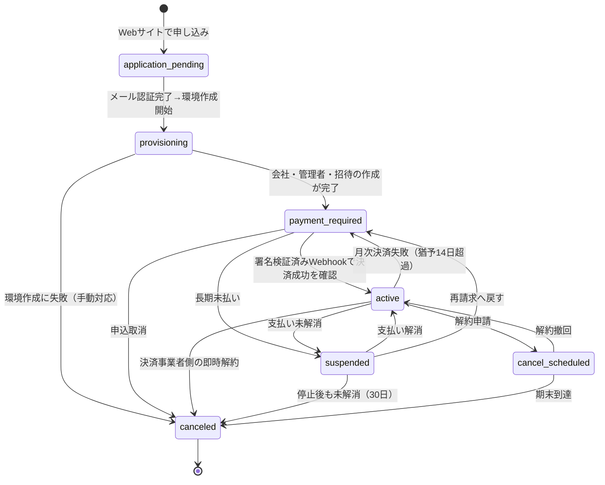

# WEB-SALES-1 — WEB完結申込・契約・決済・顧客登録・利用者招待 現状監査＋正式設計

- 実施日: 2026-08-09
- 種別: **調査・設計工程**（製品コード変更なし・本番変更なし・migration作成なし・実装なし）
- ブランチ: `feature/web-sales-1-contract-audit`（`origin/website-v3` `3ef57db` 基点）
- 成果物: 本ファイルのみ

> ## ⚠️ 本監査の結論（先に読む）
>
> **判定: 条件付きGo。設計はGo、WEB-SALES-2の実装着手はNo-Go。**
>
> 理由は2点で、いずれも代表判断がなければ工数が数倍変わる。
>
> 1. **設計SSOT（PROJECT_BIBLE 14番・15番）が「実装済み」と記録している SALES-2/3/3R の実体は、凍結された旧リポジトリ `smartlabo-works` の中にある。** 現行の正式コードベース `smartlabo-works-lite` には、申込・招待・契約状態・Stripe・メールのサーバー実装が**1行も存在しない**（実測。第5節）。本工程は旧リポジトリの参照が禁止されているため、その資産が移植可能なのか作り直しなのかを確定できていない。
> 2. **申込フローについて、本工程の指示書とPROJECT_BIBLE 14番/15番（2026-07-29 代表決定）が正面から矛盾している。** 指示書は「決済成功後に会社を作成」、Bibleは「申込直後に環境作成 → 支払い待ち → 決済で active」。どちらを正とするかで、DB設計・状態遷移・例外処理・工程分割のすべてが変わる（第9節・第14節）。
>
> このほか、販売を開始する前に**必ず**塞がなければならないセキュリティ欠陥を3件検出した（第17節 No-Go事項）。

---

## 1. 調査したリポジトリ・branch・commit

### 1-1. 着手前Git確認（読み取りのみ・想定外の変更なし）

| 項目 | Website（`C:\Users\user\Desktop\SmartLabo`） | Lite（`C:\Users\user\Desktop\smartlabo-works-lite`） |
|---|---|---|
| 着手時branch | `master` | `feature/release-8k-a-8l-a-deploy` |
| 着手時HEAD | `1252347b4a9e75621402caffc9bede1b8c312fd1` | `28e2c60bfc0f2fa2c5052cfcaa7ccd0f1181ff3a` |
| working tree | clean | clean |
| untracked | なし | なし |
| stash | なし | なし |
| worktree | 1件（本体のみ） | 1件（本体のみ） |
| origin/master | `1252347`（＝ローカルmasterと一致） | `d8c15584917bf589890b6922779fc5374ccbd41e` |
| 統合ブランチ | `origin/website-v3` = `3ef57db99cd091776257a7cd939d342ce5a6feba` | ― |

**想定外の変更は検出されなかったため、停止せず調査を継続した。**

Website本番masterの基準値 `1252347b…` と統合ブランチ `3ef57db…` は、いずれも指示書§2の記載値と一致した。

### 1-2. 調査対象branch

| 対象 | branch/commit | 備考 |
|---|---|---|
| Website 本番公開物 | `master` `1252347` の `WEBSITE/` | GitHub Pages 公開対象 |
| Website 統合（v3・未公開） | `origin/website-v3` `3ef57db` | `website-v3/` `signup-api/` `docs/` `PROJECT_BIBLE/14・15` を含む |
| Lite 製品 | `feature/release-8k-a-8l-a-deploy` `28e2c60` / `origin/master` `d8c1558` | 差分は本番反映コミット1件のみ |

> **調査手法についての注記**: `signup-api/` と `website-v3/` は master に存在せず website-v3 branch にのみ存在するため、リポジトリの状態を一切変更しないよう `git archive origin/website-v3` で一時ディレクトリへ読み取り専用に展開して調査した。checkout・stash・worktree追加は行っていない。

### 1-3. ★重要: masterとwebsite-v3が双方向に乖離している

```
master ...... 7 commits（website-v3に無い）
website-v3 .. 25 commits（masterに無い）
```

masterにのみ存在する7コミットは、WEB-V3-5A（アナリティクス基盤）・WEB-V3-5B（Company Brain SEOページ公開）を `WEBSITE/` へ反映したリリース群である。つまり **`website-v3` ブランチは、本番へ出ている最新の `WEBSITE/` を取り込んでいない。**

WEB-SALES-2以降で `website-v3/` を本番へ切り替える際、この乖離を先に解消しないと、公開済みのCompany Brain SEOページとアナリティクス設定が巻き戻る。**切替前に `master` → `website-v3` のマージが必要**（本工程では実施しない）。

### 1-4. SSOTの同期状態（不整合を検出）

| 文書 | master | website-v3 | 状態 |
|---|---|---|---|
| `PROJECT_BIBLE/14_Sales_And_Billing_Policy.md` | **存在しない** | v4.0（2026-07-29） | website-v3のみ |
| `PROJECT_BIBLE/15_Stripe_Sales_Billing_Design.md` | **存在しない** | v4.0（2026-07-29） | website-v3のみ |
| `PROJECT_BIBLE/CURRENT_STATUS.md` | Project Bible 7.9 / Last Update 2026-07-16 | Project Bible 8.1 / Last Update **2026-07-29（SALES-1）** | 乖離 |

**検出した不整合**: 14番はv3.0/v4.0で「SALES-2 ✅完了」「SALES-3 ✅完了」「SALES-3R ✅実装完了」と記録している一方、同じブランチの `CURRENT_STATUS.md` の工程表は **SALES-1 で止まっている**（`CURRENT_STATUS.md:741` が最終行）。SALES-2以降の実施記録が現在地文書へ反映されていない。

これは単なる記載漏れではなく、第5節で述べる「実装がどこにあるか分からない」問題の直接の原因になっている。

---

## 2. 現行申込導線（実測）

### 2-1. 本番（`https://smartlaboworks.com/`）で今できること

本番は `WEBSITE/` 配下＝Website v1系である（`.github/workflows/pages.yml:6-12` のトリガは `branches: [master]` × `paths: WEBSITE/**` のみ、公開成果物は `path: "WEBSITE"`）。

| 導線 | 実装 | 到達点 |
|---|---|---|
| お問い合わせ | `WEBSITE/contact.html` → `form.smartlaboworks.com`（XServer / `xserver-form/`） | info@smartlaboworks.com へメール受信（LIVE稼働確認済み） |
| 料金確認 | `WEBSITE/pricing.html` | **金額の記載なし。** Configurator（構成シミュレーター）のみ。`WEBSITE/pricing.html:84`「価格表ではなく、構成を一緒に設計するページです。…金額はすべて個別相談・個別見積りでご案内します」 |
| セルフ申込 | **存在しない** | ― |

**現時点で、WEB完結の申込導線は本番に一切存在しない。** 契約は代表との商談が必須である。

### 2-2. website-v3（未公開）で用意されているもの

`website-v3/README.md:3`「このフォルダは**公開されていません**。現行の公開サイトは `WEBSITE/` です。」

| ページ | 実測した状態 |
|---|---|
| `website-v3/pricing.html` | **金額を実テキストで掲載**（初期設定費 10,000円 `:147` / 月額 20,000円 `:151` / 追加 3,000円 `:155`、すべて税別 `:117`） |
| `website-v3/apply.html` | **申込案内ページ。フォーム要素ゼロ。** `<form>` `<input>` `fetch(` `setTimeout` の出現数はいずれも0件。`apply.html:149`「オンライン申し込みは現在準備中です。」CTAは無料相談と料金ページのみ |
| `website-v3/signup.html` | **3ステップのセルフ申込ウィザード。実働（検証まで）。** ただし `noindex, nofollow`（`:24`）・sitemap未掲載・公開9ページからリンクなし |

apply.html の設計意図はソース内に明記されている（`apply.html:18-21`）:

> このページは『申込案内ページ』であり、申込フォームではない。…フォーム要素・決済導線・ダミーの送信先は一切置いていない。受付が完了したかのような表示も禁止

**評価**: 「固定サンプル／モック／setTimeout疑似動作を本番へ残さない」という指示書§15の原則は、Website側では既に厳密に守られている。apply.html に疑似送信は存在しない。

---

## 3. Website側の既存実装

### 3-1. signup.html（実測）

| 項目 | 実測結果 |
|---|---|
| 送信先 | `action="/api/signup"` / `data-token-endpoint="/api/signup-csrf-token"`（`signup.html:130-132`） |
| 入力項目 | 11項目。会社情報6（`company_name` `company_kana` `postal_code` `address` `company_tel` `contact_email`）＋管理者4（`admin_name` `admin_email` `password` `password_confirm`）＋`additional_accounts` |
| Bot対策 | honeypot `website`（`:144`）＋ `form_ts`（`:146`）＋ `csrf_token`（`:147`） |
| 利用人数入力 | あり（`additional_accounts`、min=0 max=999、`:302-303`） |
| **キャンペーンコード欄** | **なし**（意図的。`SALES_1_SELF_SIGNUP_FOUNDATION.md:224`「入力できても何も起きない欄を先に見せると誤解を招くため」） |
| **紹介コード欄** | **なし**（同上） |
| 料金計算 | `assets/js/signup.js:37` `PRICE = { monthly: 20000, additional: 3000 }`、`:252-267` `updateQuote()`。**表示専用でサーバーへ送らない**（`:11-12`） |
| 疑似動作 | **なし**。実 `fetch`（`:340-349`、`credentials: 'omit'`）。setTimeout の出現なし |
| JS無効時 | 14入力欄が全表示され、通常POSTで `/api/signup` へ送信される |

**契約が成立しないことは画面とAPIの両方で明示されている**（`signup.html:99` 「お支払いのお手続きは準備中です。」`:102-103`「ご契約は成立しません。」）。

### 3-2. 料金表示の実測値と不整合

| 表記 | pricing.html | apply.html / signup.html |
|---|---|---|
| 税表記 | 「**税別**」（`:117` `:161` `:427`） | 「**税抜**」（`apply.html:133` `:266` / `signup.html:295` `:342`） |

同一の意味だが用語が揺れている。法務ページ整備時に統一すべき軽微な事項（第21節 判断事項12）。

### 3-3. キャンペーンの実装状態

`website-v3/index.html:1203-1240` に創業記念キャンペーン（初期設定費無料＋基本料金1か月分無料・先着50社・カード登録必須）を掲載。実装方針がソースに明記されている（`index.html:1196-1201`）:

> 「初月無料」ではなく「基本料金1か月分無料」と書く／「先着50社」は表示するが、**残数の自動減算・カウントダウンは実装しない（実数の裏付けがないため）**／「予告なく終了」ではなく「募集枠または期間の終了により終了」と書く

**pricing.html にはキャンペーン記載が一切ない**（「キャンペーン」「先着」の出現0件）。index.html と apply.html のみ。

### 3-4. contact-api（再利用可能な実績あるパターン）

素のPHP 8・Composer不使用・XServer配置。`contact-api/public/contact.php:5-14` に処理順が明記されている。

| 防御 | 実装 |
|---|---|
| CSRF | ステートレスHMAC。`security.php:65-72` 発行 / `:75-95` 検証（`hash_equals`・TTL 7200秒・長さ上限200・負の経過時間拒否） |
| Origin/CORS | `security.php:34-55`。Origin完全一致 → 無ければRefererをparse_urlしてscheme+host+port一致。**ワイルドカード不使用**、`Vary: Origin` 付き |
| rate limit | `security.php:158-198`。ファイル+`flock(LOCK_EX)`。既定 3回/600秒。**生IPは保存せずHMAC-SHA256先頭32文字のみ**（`:28-31`）。dir 0700 / file 0600 |
| 入力validation | `validate.php`。UTF-8妥当性→制御文字/改行除去→`strip_tags`→項目別（メールは改行混入拒否＋`FILTER_VALIDATE_EMAIL`） |
| メール | PHP `mail()`＋envelope-from固定。ヘッダ値は `slw_header_safe()` でCR/LF除去（ヘッダインジェクション対策）。件名RFC2047エンコード |
| 秘密値分離 | 実設定はドキュメントルート**外**の `private/contact-config.php`。`private/.htaccess` は `Require all denied`。雛形のみGit管理 |
| ログ | **問い合わせ内容をログに保存しない**（`contact.php:19` `:234-240`） |

**この設計は指示書§15のセキュリティ原則をほぼ全て満たしており、WEB-SALES-2以降でそのまま踏襲すべき実績パターンである。**

### 3-5. 決済コードの有無

`website-v3/` `WEBSITE/` `contact-api/` `xserver-form/` に対する `stripe|paypal|square|payjp|gmo|checkout.js|card-element` の検索結果は **全て0件**。外部スクリプトはGTM（`GTM-KKRD8BZR`）のみ。**カード入力欄・決済SDKはWebsiteに存在しない。**

---

## 4. signup-api の実態

**結論: 「実働可能な雛形」。コードとしては動作し、テストも通っているが、本番未配置で、何も保存しない。**

### 4-1. 実装されているもの

`signup-api/public/signup.php:13-24` に処理順が明記されている（10段階）。

1. POST以外を拒否（405）
2. 本文サイズ上限（413）
3. Content-Type確認（415）
4. 設定充足確認（不足時は内容を明かさず500）
5. Origin/Referer 許可一覧（403）
6. honeypot・時間差（400・理由を伝えない）
7. CSRFトークン（403）
8. 送信間隔制限（429）
9. UTF-8確認 → 入力検証（422・理由コード付き）
10. **料金の再計算 → 200**

金額の正はサーバー側にある（`signup-api/public/lib/pricing.php:23-25`）:

```php
const SLS_PRICE_INITIAL    = 10000;
const SLS_PRICE_MONTHLY    = 20000;
const SLS_PRICE_ADDITIONAL = 3000;
```

`sls_quote()`（`pricing.php:39-63`）は `'tax_included' => false`・`'first_charge' => null` を返す。日割りを自前計算しない設計理由もソースに明記（`pricing.php:33-37`「自前計算とStripeの請求額がずれる事故を構造的に防ぐため」）。

### 4-2. 実装されていないもの（ソースが自ら宣言している）

`signup-api/public/signup.php:7-11`:

> ★このエンドポイントは何も保存しない。会社も、管理者も、パスワードも、DBにもファイルにも書き込まない。メールも送らない。Stripeも呼ばない。アカウントも作らない。

レスポンスにも `"persisted": false` を含め、保存していないことをAPI自身が明示している（`signup.php:161`）。

### 4-3. 配置状態

`signup-api/README.md:5`「**このAPIはまだ本番へ配置していません**」。`SALES_1_SELF_SIGNUP_FOUNDATION.md:198` によれば、signup.html を開くとCSRFトークン取得が404になる（API未配置のため）。

### 4-4. テスト実績

| テスト | 結果 |
|---|---|
| `tests/test-validate.php` | 56件 / 56件成功 |
| `tests/test-http.php` | 33件 / 33件成功（改ざん耐性: 画面から `monthly_total: 1` を送ってもサーバー計算が優先されることを含む） |

### 4-5. 判定

| 問い | 答え |
|---|---|
| signup.html は本番利用可能か | **不可**。noindex・未リンク・API未配置・決済導線なし |
| signup-api は実働可能か | **実働するが、契約は成立しない**（検証のみ）。雛形でも旧仕様でもなく「意図的に第1段階で止めてある実装」 |
| 既存処理を再利用できるか | **できる。** 受け付け判定1〜9とvalidate/pricing/responseはそのまま使える |
| 置き場所は確定しているか | **未確定**（15番の代表判断9-8が未決のまま。`signup-api/README.md:17-19`） |

---

## 5. ★Lite側の会社・ユーザー作成実装 — 最重要の発見

### 5-1. 設計SSOTと現行コードベースの断絶

PROJECT_BIBLE 15番 第0章「実装状況」は次を「✅実装済み」と記録している（実装場所として `smartlabo-works` を明記）:

| 項目 | 15番の記載 | 記載された実装場所 |
|---|---|---|
| 申込情報の保存 | ✅実装済み | `src/repositories/signupApplicationRepository.js` |
| 会社環境の作成 | ✅実装済み | `src/repositories/companyRepository.js`（`createProvisionedCompany`） |
| 管理者アカウント作成 | ✅実装済み | `src/repositories/tenantUserRepository.js` |
| 招待トークン（発行・期限・失効・再発行・使い捨て） | ✅実装済み | `src/repositories/invitationRepository.js` |
| 招待メール送信キュー | ✅実装済み（実送信は未実装） | `src/repositories/invitationEmailOutboxRepository.js` |
| 契約状態と遷移規則 | ✅実装済み | `src/services/sales/contractState.js` |
| `payment_required` の利用制御 | ✅実装済み | `src/services/sales/accessPolicy.js` |
| Stripe Customer / Checkout Session | ✅実装済み（SALES-3） | `src/services/sales/stripeClient.js` |
| Webhook署名検証・冪等・順不同対策 | ✅実装済み（SALES-3） | `src/services/sales/stripeWebhook.js` |
| `payment_required` → `active` | ✅実装済み（SALES-3） | `src/services/sales/billingService.js` |

DBスキーマは **migration 18・19・20**（`create_sales_provisioning_tables` / `create_stripe_billing_tables` / 支払い猶予）と記録されている。

### 5-2. 現行の正式コードベース `smartlabo-works-lite` の実測

**上記のいずれも存在しない。**

| 検査対象 | 実測 |
|---|---|
| `server/db/migrations/` | **001〜016のみ**（欠番なし）。migration 17以降は存在しない。請求・課金・プラン・ライセンス・招待のテーブルは1件もない |
| `server/routes/` | 16本（ai, auth, companies, customerImport, customers, docBox, documentDrafts, files, manuals, me, records, schedules, search, tasks, usage, users）。**billing / contract / license / plan / stripe / invitation / signup なし** |
| `server/services/` | 上記6種に該当するファイルなし。`sales/` ディレクトリなし |
| `server/repositories/` | 14本。**billing / invoice / license / plan / invitation / signupApplication なし** |
| `package.json` | `stripe` 依存なし。メール送信ライブラリなし |
| 招待機能 | `invite` / `invitation` / `invite_token` の検索結果 **0件** |
| メール送信基盤 | `nodemailer` / `smtp` / `sendmail` **0件**。`.env.example` にSMTP系変数なし。`server/config.js` にメール設定なし |

### 5-3. これが意味すること

現行の正式コードベースは、**販売・契約・決済に関してゼロベースである。** 15番が「実装済み」と書いている資産は、指示書§1・§19により参照・操作が禁止されている凍結リポジトリ `smartlabo-works` の中にあり、**本監査ではその存在・品質・移植可能性を確認していない**（意図的に確認していない）。

したがって次の3つのシナリオが考えられ、工数が大きく変わる。

| シナリオ | WEB-SALES-2以降の見込み |
|---|---|
| A: 旧実装が現行構造と互換で移植できる | 大幅短縮。設計は15番をほぼそのまま採用できる |
| B: 旧実装は参考にはなるが構造が違い作り直し | 設計は流用、コードは新規。中程度 |
| C: 旧実装を使わずゼロから作る | 最大工数（本監査の見積りはこの前提で算出している） |

**→ 第21節 代表判断事項 #1。**

### 5-4. Lite側で「既にあり、再利用すべき」もの（実測）

ここは非常に良い状態にある。

#### 認証（`docs/AUTH_ARCHITECTURE.md` / `server/`）

| 項目 | 実装 |
|---|---|
| 方式 | **サーバー側セッション**（SQLite `sessions` テーブル）。JWTは明示的に不採用（`server/middleware/session.js:4`） |
| セッションID | `randomBytes(32).toString('base64url')`（`server/repositories/sessionRepository.js:12`） |
| Cookie | `HttpOnly` / `SameSite=Lax` / 本番のみ `Secure`（`session.js:33-43`）。名称 `slw_sid`、TTL既定8時間・スライディング延長 |
| パスワード | **scrypt**（N=16384, r=8, p=1, keyLen=64, salt 16bytes）。保存形式 `scrypt$N$r$p$<salt>$<hash>`（`server/utils/password.js:11-30`）。照合は `timingSafeEqual`（`:45`） |
| タイミング攻撃対策 | ユーザー非存在時もダミーハッシュで照合（`server/services/authService.js:55`） |
| 初回パスワード強制変更 | `session.js:127-160`。許可されるのは5エンドポイントのみ、他は403 `PASSWORD_CHANGE_REQUIRED` |

**評価**: 招待→初回パスワード設定の導線は、この `mustChangePassword` の仕組みを拡張すれば自然に実装できる。

#### テナント分離（★指示書§15の中核要件を既に満たしている）

`server/middleware/session.js:112`:

```js
export const companyIdOf = (req) => req.session?.companyId ?? null
```

直前のコメント（`:109-111`）に「リクエスト本文・クエリの company_id は使わない」と明記。ルート層も徹底しており、`server/routes/customers.js:5-7`「リクエスト本文に company_id / companyId が含まれていても無視する」。

Repository層は第1引数に `companyId` を受け、全SQLの WHERE に必ず含めるパターンで統一されている（`server/repositories/customerRepository.js:37-47` 等）。

**例外は運営者のみ**: `server/routes/users.js:47-50` で `req.actor.isOperator` の時だけ `req.query.companyId` を受け付ける。非運営者は `userService.actorScope` で自社に固定（`userService.js:137`「company_admin は自社に固定する（クエリの会社IDは使わない）」）。

**評価: 「company_idはサーバー側の確定情報から取得」「クライアント送信のcompany_idを信用しない」「他社データ混入禁止」は既に構造として実装済み。WEB-SALES-2以降はこのパターンを崩さないことが最優先。**

#### 会社作成・company_id発行

```js
// server/services/companyService.js:134
id: `co-${randomUUID().slice(0, 8)}`,
```

- API: `POST /api/companies`（`server/routes/companies.js:36-46`）。`companiesRouter.use(requireOperator)`（`:18`）で配下全体が運営者専用
- `companyCode` は `^[A-Za-z0-9-]{2,20}$` でDB上UNIQUE（`002_create_auth_tables.sql:17`）、作成時に重複検査（`companyService.js:129-130`）
- **会社の削除APIは存在しない**（`companies.js:6`「削除APIは作らない。契約状態（status）で管理する」）

**評価: company_idはサーバー側で生成されており、AIにもクライアントにも作らせていない。指示書§4の要件を満たす。provisioningはこの `createCompany` を内部から呼ぶ形で実装できる。**

#### ユーザー作成

- API: `POST /api/users`（`server/routes/users.js:74-84`）→ `userService.createUser`（`userService.js:189-220`）
- ID: `u-${randomUUID().slice(0, 8)}`（`:206`）
- 初期パスワードは**サーバー生成**（14文字・4種必須・紛らわしい文字除外・Fisher-Yatesシャッフル、`server/utils/initialPassword.js:23-33`）。ハッシュのみ保存し、平文はレスポンスで**一度だけ**返す（`:202-203, 219`）
- `mustChangePassword: true` を必ず立てる（`:214`）
- 権限: operator / company_admin のみ（`routes/users.js:34-43`）

#### 権限管理

```js
// server/services/authService.js:18-22
export const ROLES = { OPERATOR: 'operator', COMPANY_ADMIN: 'company_admin', USER: 'user' }
```

管理者保護ロジックも実装済み: 自分自身の停止禁止（`userService.js:241-243`）・自分の管理者権限剥奪禁止（`:245-251`）・**会社の最後の管理者を消す操作を禁止**（`:253-266`, `LAST_ADMIN_PROTECTED`）。

**評価: 「管理者変更」の例外処理（指示書§14）の土台は既にある。**

#### 監査ログ

- テーブル `audit_logs`（`002_create_auth_tables.sql:56-67`）。列は `id, company_id, user_id, action, target_type, target_id, created_at`
- 実装 `server/repositories/auditLogRepository.js:89-99` `record()`。**失敗しても本処理を止めない**（`:96-98`）
- アクション定数 約45種（`:12-83`）
- **個人情報を残さない方針**（`:4-5`「顧客名・メール・電話・メモなどの個人情報は保存しない」）
- **閲覧API・画面は未実装**（`:6`「一覧画面は今回作らない」）

### 5-5. Lite側の契約・課金の現状（実測）

サーバー側にあるのは `companies` テーブルの**列だけ**である。

```sql
-- 002_create_auth_tables.sql:18
plan TEXT NOT NULL DEFAULT 'lite',
status TEXT NOT NULL DEFAULT 'active',
-- 003_extend_companies.sql:13-15
contract_started_at TEXT,
contract_end_at     TEXT,
license_count       INTEGER NOT NULL DEFAULT 1,
```

- 契約状態は3値のみ: `active` / `suspend_scheduled` / `suspended`（`companyService.js:18`）。契約終了日を過ぎた `suspend_scheduled` は参照時に `suspended` として返す（`:36-45` `withEffectiveStatus`）
- `plan` の許容値は `['lite', 'standard', 'enterprise']`（`:19`）
- **`subscription` はソース全体で0ヒット**

### 5-6. Lite側フロントエンドの契約・課金画面はすべてモック

| service | 判定 | 根拠 |
|---|---|---|
| `src/services/billingService.js` | 完全モック（純計算） | `:2`「請求サービス（モック）」。import は `../mock/` のみ、fetch/apiClient 参照ゼロ |
| `src/services/contractService.js` | 完全モック | `:14-15`「今回やらないこと：Stripe API・決済・…サーバーAPI」 |
| `src/services/licenseService.js` | 完全モック | `:14-19` `import from '../mock/licensesData'` |
| `src/services/planService.js` | 完全モック（同期） | `:12-17` `import { PLANS } from '../mock/plansData'` |
| `src/services/companyService.js` | 完全モック（メモリ内） | `:38`「デモ用のメモリ内ストア（再読み込みで初期化される）」 |

**保存はメモリのみ。localStorage不使用。** 疑似遅延（`setTimeout` 200〜500ms）と疑似エラー注入があるが、疑似エラーは `demoState.js:30` `if (!import.meta.env.DEV) return 'normal'` により本番では常に正常系。

**到達可能性**:

- `BillingPanel.jsx` / `ContractPanel.jsx` / `LicensePanel.jsx` は**どこからも import されていない孤児**。`dist/` 全文検索で該当文字列0件＝tree-shakeで本番バンドルから完全に落ちている（`CURRENT_STATUS.md:724-725`「Step 9-1〜9-3のMockコンポーネントはリポジトリに残しているが呼び出していない」）
- **一方 `PlatformCatalogPanel` は本番に出ている。** `CompaniesPage.jsx:9,283` で描画され、`dist/assets/CompaniesPage-*.js` に `initialFee:1e4, basePrice:2e4, additionalUserPrice:3e3` が含まれる。**運営者ロールでログインすると `/admin/companies` 下部にモック料金表が表示される**（一般利用者・会社管理者には表示されない）

**評価: 「固定サンプル／モックを本番へ残さない」という原則に対し、Lite側には残存がある。** ただし表示対象は運営者のみで、金額は正規値と一致しているため実害は限定的。WEB-SALES-7（契約管理画面）で実データへ置き換える際に解消すべき。

---

## 6. 認証・テナント分離の評価

第5-4節のとおり、**テナント分離は本監査で最も良好な領域**である。指示書§15の以下は既に構造として満たされている。

- ✅ company_idはセッションおよびサーバー側の確定情報から取得
- ✅ クライアント送信のcompany_idを信用しない
- ✅ 他社データ混入禁止（Repository層で強制）
- ✅ パスワード平文保存禁止（scrypt）

一方、**満たされていない**ものが3件ある（詳細は第17節）。

| 欠陥 | 実測 |
|---|---|
| 停止中会社のアクセス遮断が**ログイン時のみ** | `authService.js:58-64` で `COMPANY_INACTIVE` を返すが、`loadSession`（`session.js:69-80`）と `sessionRepository.find()`（`:28-44`）は `expires_at` しか見ない。**会社を `suspended` にしても、ログイン中の利用者は最大8時間（アクセスのたび延長）業務APIを使い続けられる** |
| 利用人数上限が**強制されない** | `userService.js:161-162`「// 超過していても登録は禁止しない（画面で警告のみ）」。`createUser` にライセンス超過チェックなし |
| ログイン試行制限が**存在しない** | `/api/auth/login` に適用されるレート制限コードなし。レート制限があるのはAI（`config.js:331-336`）とOCR（`:169`）のみ |

**なお、正しい実装パターンは既にリポジトリ内に存在する**: パスワード再発行時は `sessions.destroyByUser(id)` を明示的に呼んでいる（`userService.js:295`）。停止処理にも同じ呼び出しを追加すれば済む。

### 6-1. メールアドレス一意制約（招待設計に直結する重大制約）

```sql
-- 002_create_auth_tables.sql:28
email TEXT NOT NULL UNIQUE,
```

**グローバルUNIQUE。会社スコープではない。** 複合UNIQUE `(company_id, email)` は存在しない。アプリ層も全社横断で重複検査している（`userService.js:198-200` — `findUserByEmail` に companyId を渡していない）。

設計意図は明記されている（`userService.js:11`「メールアドレスは全社で重複させない（ログインの識別子のため）」）。

**帰結**:
- **1つのメールアドレスは1社にしか所属できない。** 兼務・グループ会社・退職後の別社入社は、現行設計では扱えない
- 招待時に「そのメールが既に他社に存在する」ケースが必ず発生する。指示書§11の「他社所属との競合処理」は必須の設計項目
- **注意点（潜在バグ）**: DBの UNIQUE は大文字小文字を区別するが、アプリ層の検索は `lower(u.email) = lower(?)`（`userRepository.js:50`）。正規化レイヤーが一致していないため、`A@x.jp` と `a@x.jp` がDB上は別レコードとして通る余地がある。**招待でメールを外部入力させるようになると顕在化する**

---

## 7. 管理者ダッシュボード

### 7-1. Lite側 Step 8L-A ダッシュボード（テナント向け）

- 画面: `src/pages/DashboardPage.jsx`。既存API 8本を `Promise.allSettled` で並列取得（`:63-72`）
- サーバー追加は読み取り専用 `GET /api/usage` の1本のみ（`server/routes/usage.js:31-42`）
- 表示: KPI（顧客数・未完了タスク・今日の予定・社内資料）／今日の予定／今日のタスク／AI利用状況／Company Brain概要／AI資料ボックス概要／CRM概要／最近の活動／お知らせ
- **これは「顧客企業が自社の状況を見る画面」であり、株式会社スマートラボが契約先を管理する画面ではない**

### 7-2. 運営者向け会社管理（実データ・部分実装）

- `/admin/companies` `/admin/companies/:id` `/admin/catalog`（`src/App.jsx:83-85`）。`operatorOnly: true`（`navItems.js:59-73`）、サーバー側も `requireOperator`
- `CompanyDetail.jsx` は実APIの `companyAdminService` を使用（`:10-14`）
- **未接続項目を画面上に明示している**（`CompanyDetail.jsx:19-24, 314-330`）:

```js
const PENDING_SECTIONS = ['部署（Department）', 'ライセンス割当', '請求・請求スナップショット', 'AI利用状況']
```

`CURRENT_STATUS.md:5650`「会社管理：**決済・請求書発行・メール送信は未実装**。」

### 7-3. 不足しているもの

指示書§13が求める「株式会社スマートラボ側の顧客・契約管理」に必要な項目のうち、**現在存在するのは会社名・契約状態(3値)・契約開始/終了日・license_count のみ**。以下はすべて未実装:

顧客番号／代表管理者／連絡先／申込日時／メール認証日時／契約人数と登録完了人数の区別／招待待ち人数／初期設定進捗／基本料金・追加料金・初期設定費・月額合計／決済状態／次回決済日／解約予定日／キャンペーンコード／紹介コード／アカウント発行状態／失敗内容の分類／再処理可否／監査ログ閲覧

---

## 8. メール基盤

**Website側とLite側で状況が正反対である。**

| | 状態 |
|---|---|
| Website（`contact-api/`） | PHP `mail()` で**実送信中・LIVE稼働確認済み**。ヘッダインジェクション対策・RFC2047件名エンコード実装済み |
| Website（`xserver-form/`） | **外部ライブラリ不使用の自前SMTPクライアント**（STARTTLS/SSL + AUTH LOGIN、`SmtpMailer.php`）。reCAPTCHA・受付番号・SQLite永続レート制限あり。ただし旧v1系フォーム用 |
| Lite（製品） | **完全未実装**。ライブラリ・SMTP設定・送信コードのいずれも存在しない |

**これがLite側で招待機能・パスワード自己再設定が存在しない根本原因である。** 現在の運用は「管理者が初期パスワードを画面で一度だけ見て、口頭・書面で伝達」（`server/utils/initialPassword.js:5-7`）。

**WEB-SALES-3以降でメール基盤の新設は必須。** ただしゼロからではなく、`xserver-form/public/lib/SmtpMailer.php` の設計（ヘッダ安全化・エンコード・失敗ログ）を仕様として移植できる。

---

## 9. DB・migration

### 9-1. migrationの仕組み（Lite）

- `server/db/index.js:45-89` `runMigrations()`。`db/migrations/*.sql` をファイル名ソートで実行し `schema_migrations(version, applied_at)` に記録
- 各ファイルは `BEGIN`/`COMMIT`、失敗時 `ROLLBACK`（`:67-77`）
- SQL内に `-- migration-requires: foreign_keys_off` を書くとFKを一時OFFにし、終了後 `PRAGMA foreign_key_check` で違反検査（`:64-65, 79-87`）
- **down migrationは存在しない**（全ファイルが前進のみ）
- DBは Node標準 `node:sqlite` の `DatabaseSync`。`PRAGMA foreign_keys = ON` / `journal_mode = WAL`（`index.js:97-98`）

**新規migrationは 017 から連番で追加する。本工程では作成しない。**

### 9-2. 既存テーブルの実カラム（抜粋）

**companies**（002 + 003、計18列）: `id`(TEXT PK) / `company_name` / `company_code`(UNIQUE) / `plan`(既定'lite') / `status`(既定'active') / `created_at` / `updated_at` / `contract_started_at` / `contract_end_at` / `license_count`(既定1) / `company_type` / `industry` / `timezone` / `language` / `ai_default_model` / `company_brain_enabled` / `company_brain_plan` / `option_flags`

**users**（002 + 004、計13列）: `id`(TEXT PK) / `company_id`(FK→companies) / `name` / `email`(**UNIQUE**) / `password_hash` / `role`(既定'user') / `status`(既定'active') / `last_login_at` / `created_at` / `updated_at` / `must_change_password` / `password_updated_at`

**注意点（実測）**: `sessions.user_id` にFKはあるが `company_id` にFKがない（`002:44, 49`）。`audit_logs` にはFKが一切ない（`:56-64`）。

### 9-3. 顧客企業のCRM顧客との区別（混同なし・良好）

| 概念 | テーブル | 意味 |
|---|---|---|
| **契約企業（テナント）** | `companies` | 株式会社スマートラボの顧客企業。顧客データはこのIDで分離する（`002:5`） |
| **CRM顧客（取引先）** | `customers` | 顧客企業が管理する取引先。`company_id` は**所有テナント**を指す（`001:14`） |

紛らわしい点として `customers.company_name`（`001:17`）が存在するが、これは取引先の会社名という**単なる表示用文字列**で、`companies.company_name` とは無関係。

削除方針も分かれている: CRM顧客は論理削除（`001:29` `deleted_at`、`001:7`「物理削除は行わない」）、テナントは削除せず status 管理。

**指示書§13の「混同しないこと」は既に守られている。新規テーブルもこの区別を維持する。**

---

## 10. 再利用できる機能

| # | 機能 | 所在 | 再利用方針 |
|---|---|---|---|
| R1 | 申込フォームの受け付け判定（メソッド/サイズ/Content-Type/Origin/honeypot/時間差/CSRF/rate limit） | `signup-api/public/signup.php:54-137`、`lib/security.php` | **そのまま踏襲**。Nodeへ移す場合も規則を1:1で移植 |
| R2 | 入力validation（56テスト付き） | `signup-api/public/lib/validate.php` | 規則を仕様として移植。理由コード体系（`required`/`too_long`/`weak` 等）も維持 |
| R3 | 料金の正規値とサーバー再計算 | `signup-api/public/lib/pricing.php:23-25, 39-63` | **必須で踏襲**。画面申告の金額を使わない原則ごと |
| R4 | 共通レスポンス形式（`data.next` 拡張前提） | `signup-api/public/lib/response.php` | 決済URLを `data.next` に足すだけで拡張できる設計 |
| R5 | 秘密値の分離（ドキュメントルート外 + `.htaccess` 全拒否 + 雛形のみGit管理） | `contact-api/` `signup-api/private/` | **public Websiteリポジトリとprivate設定の分離**の実績パターン |
| R6 | メール送信の安全化（ヘッダCR/LF除去・RFC2047・envelope-from固定） | `xserver-form/public/lib/SmtpMailer.php`、`contact-api/public/lib/mailer.php` | Liteのメール基盤新設時に仕様として移植 |
| R7 | セッション認証・scryptパスワード・timingSafeEqual | `server/middleware/session.js`、`server/utils/password.js` | **変更せず利用** |
| R8 | テナント分離（`companyIdOf` + Repository層WHERE強制） | `server/middleware/session.js:112`、各Repository | **絶対に崩さない。新規Repositoryも同一パターンで書く** |
| R9 | company_id / user_id のサーバー生成 | `companyService.js:134`、`userService.js:206` | provisioningから内部呼び出し |
| R10 | 初期パスワード生成＋`mustChangePassword` 強制 | `server/utils/initialPassword.js`、`session.js:127-160` | 招待後の初回パスワード設定へ転用 |
| R11 | 最後の管理者を消せない保護 | `userService.js:253-266` | 管理者変更の例外処理に流用 |
| R12 | 監査ログ書き込み（失敗しても本処理を止めない） | `auditLogRepository.js:89-99` | 契約イベントの記録に流用。**閲覧UIは新規** |
| R13 | 許可リスト方式のAPI制御という考え方 | 15番 4-1-2（設計のみ） | `payment_required` 制御に採用 |
| R14 | ステートレスHMAC CSRF | `contact-api/public/lib/security.php:65-95` | 申込フォームへ適用 |
| R15 | 生IPを保存しないrate limit（HMACハッシュのみ） | `security.php:28-31, 158-198` | 申込・ログイン・招待の各所へ適用 |
| R16 | 料金整合の機械検査 | `docs/reviews/tools/check-prices.js` | 料金・公開導線ガードの回帰防止に継続使用 |

---

## 11. 新規実装が必要な機能

| # | 機能 | 現状 | 置き場所（推奨） |
|---|---|---|---|
| N1 | 申込データの永続化（`signup_applications`） | 未実装（signup-apiは `persisted:false`） | Lite `server/` |
| N2 | メール送信基盤（SMTP・キュー・再送・失敗記録） | Lite側 完全未実装 | Lite `server/` |
| N3 | メール認証トークン（発行・ハッシュ保存・失効・再送制限） | 未実装 | Lite `server/` |
| N4 | パスワード設定画面（招待/認証リンクからの初回設定） | 未実装（管理者による初期パスワード発行のみ） | Lite `src/` |
| N5 | 規約同意の記録（`consent_records`・規約version・同意日時） | 未実装 | Lite `server/` |
| N6 | 決済連携（Checkout Session作成・Webhook受信・署名検証・冪等） | 未実装 | Lite `server/` |
| N7 | 契約状態（`contract_status`）と遷移規則の強制 | 未実装（`companies.status` 3値のみ） | Lite `server/` |
| N8 | `payment_required` 中の利用制御（許可リスト方式） | 未実装 | Lite `server/` |
| N9 | provisioning処理（会社＋管理者＋招待の原子的作成）と失敗の再処理 | 未実装 | Lite `server/` |
| N10 | 利用者招待（トークン・期限・再送・取消・重複防止・他社所属競合） | **完全未実装** | Lite `server/` + `src/` |
| N11 | 契約人数上限の**サーバー側強制** | 警告のみ（`userService.js:161-162`） | Lite `server/` |
| N12 | 停止中会社・無効ユーザーの**セッション即時無効化** | ログイン時のみ判定 | Lite `server/` |
| N13 | ログイン試行制限 | 未実装 | Lite `server/` |
| N14 | 運営者向け顧客・契約管理画面（第7-3節の全項目） | 会社一覧/詳細のみ | Lite `src/` |
| N15 | 監査ログの閲覧UI | 書き込みのみ | Lite `src/` |
| N16 | 解約予約・解約・契約終了後のアクセス制御とデータ保持 | 未実装 | Lite `server/` |
| N17 | 申込フォーム本体（Website公開ページ） | signup.html は未公開・未リンク | Website `website-v3/` |
| N18 | 特定商取引法に基づく表記ページ | **存在しない** | Website |
| N19 | キャンペーン規約ページ | **存在しない** | Website |
| N20 | 利用規約の契約条項（期間・支払・解約・返金） | terms.html は**サイト利用条件のみ** | Website（法務確認必須） |

---

## 12. Website／非公開API／Lite の責務分担

### 12-1. 推奨する分担

```
[ Website ]  smartlaboworks.com（GitHub Pages・publicリポジトリ・静的のみ）
    申込フォーム画面 / 料金表示 / 規約・特商法・キャンペーン規約 / 完了画面
    ★秘密値ゼロ。APIキー・鍵をHTML/JSに出さない
        │  HTTPS + CORS(完全一致) + CSRF + honeypot + rate limit
        ▼
[ Lite API ]  lite.smartlaboworks.com（VPS・privateリポジトリ）
    /api/public/signup          申込受付・検証・料金再計算・signup_applications保存
    /api/public/verify-email    メール認証トークン検証
    /api/public/invitations/... 招待受諾・パスワード設定
    /api/billing/checkout       Checkout Session作成（要ログイン）
    /api/webhooks/payment       ★署名検証・冪等・順不同耐性
    provisioning / 契約状態 / テナント分離 / 利用制御 / 監査ログ
        │
        ▼
[ 決済事業者 ]  カード情報はここだけが保持（自社は一切保持しない）
```

### 12-2. 「非公開API（XServer/PHP）」を使わない理由

指示書は「XServer等の非公開API側が担当すべき処理」を明確にするよう求めている。実測に基づく結論は次のとおり。

**申込受付とWebhookは XServer(PHP) ではなく Lite(Node) に置くことを推奨する。**

| 論点 | XServer/PHP案（`signup-api` を発展） | **Lite/Node案（推奨）** |
|---|---|---|
| provisioning | LiteのDBへ越境が必要。company_id発行が2系統に割れる | 同一プロセス・同一トランザクションで完結 |
| テナント分離の一貫性 | R8のパターンをPHP側で再実装する必要がある | 既存パターンをそのまま使える |
| Webhook→会社作成 | HTTP越しの二段構えになり、失敗点が増える | 1段で済む。`provisioning_jobs` の再処理も単純 |
| 既存資産 | `signup-api` の受け付け判定・validation・pricingが動作実績あり | 同じ規則をNodeへ移植する作業が発生（約1日） |
| 秘密値管理 | 実績あり（`private/` + `.htaccess`） | `.env` + VPS。既に運用中 |

**移設コストは低い。** `signup-api/README.md:24-30` が明記するとおり、何も永続化していないため移すデータがなく、画面が知っているのは `/api/signup` というURLだけである。

**ただしこれは15番の代表判断9-8（未決）に該当する。→ 第21節 判断事項 #3。**

### 12-3. publicリポジトリへ入れてはいけないもの

| 種別 | 扱い |
|---|---|
| 決済APIキー（テスト鍵・本番鍵）／Webhook署名シークレット | Lite VPSの環境変数のみ。**HTML/JSに絶対に出さない** |
| CSRF署名鍵／IPハッシュ鍵／SMTP認証情報 | 同上。雛形（`*.example.*`）のみGit管理 |
| 受信メールアドレス・許可オリジンの本番値 | 設定ファイル側（現行 `contact-api` と同じ扱い） |
| Webhookエンドポイントのパス | 推測困難な値にし、公開資料へ書かない |

**現行の `.gitignore` 運用（`contact-api/.gitignore`・`signup-api/.gitignore`・リポジトリ直下の `b3d5df9 chore(security): ignore production API config files`）は既に正しい。この方式を継続する。**

---

## 13. 推奨データモデル

**本工程ではmigrationを作成しない。以下は設計案である。**

### 13-1. 既存テーブルで代用できるもの

| 指示書§8の候補 | 既存で代用 |
|---|---|
| （会社） | `companies` — そのまま使う |
| （管理者・利用者） | `users` — そのまま使う |
| `audit_log` | `audit_logs` — 既存。**アクション定数を追加するだけ**で契約イベントを記録できる |

### 13-2. 新規が必要なもの（migration 017〜）

既存の命名規約に合わせる: テーブル名 snake_case 複数形／`id` は TEXT PK でプレフィックス付き（`co-` `u-` に倣う）／`created_at` `updated_at` は TEXT（ISO8601）／論理削除は `deleted_at`。

```
signup_applications（申込途中データ。まだテナントではない）
  id                    TEXT PK   'sa-' + uuid8
  status                TEXT      13-3の申込状態
  company_name          TEXT
  company_kana          TEXT
  postal_code           TEXT
  address               TEXT
  company_tel           TEXT
  contact_email         TEXT
  admin_name            TEXT
  admin_email           TEXT
  planned_user_count    INTEGER   契約予定人数（管理者含む）
  campaign_code         TEXT NULL ※紹介コードとは別カラム（14番7章の指示）
  referral_code         TEXT NULL
  company_id            TEXT NULL FK→companies（provisioning後に確定）
  expires_at            TEXT      放置申込の掃除用
  created_at / updated_at
  ※パスワードは受け取らない（招待メールから設定させる）
  ※UNIQUE(admin_email) は張らない。二重申込は status とアプリ層で制御（13-5）

email_verification_tokens（代表管理者のメール到達確認）
  id                    TEXT PK
  application_id        TEXT FK→signup_applications
  token_hash            TEXT UNIQUE  ★平文を保存しない（sha256）
  purpose               TEXT      'admin_email_verify'
  expires_at            TEXT      発行から24時間（案）
  consumed_at           TEXT NULL 利用後失効
  revoked_at            TEXT NULL 再送時に旧トークンを失効
  send_count            INTEGER   連続再送制限
  created_at

user_invitations（追加利用者の招待）
  id                    TEXT PK   'iv-' + uuid8
  company_id            TEXT FK→companies   ★サーバー側で確定した値のみ
  email                 TEXT
  invited_by_user_id    TEXT FK→users
  role                  TEXT      'user' | 'company_admin'
  token_hash            TEXT UNIQUE  ★平文を保存しない
  status                TEXT      pending | accepted | expired | revoked
  expires_at            TEXT
  accepted_user_id      TEXT NULL FK→users
  accepted_at / revoked_at
  send_count            INTEGER
  created_at / updated_at
  UNIQUE(company_id, email) WHERE status='pending'   ※同一会社への重複招待防止

subscriptions（契約・課金。1社1契約）
  id                    TEXT PK   'sb-' + uuid8
  company_id            TEXT FK→companies UNIQUE
  plan_code             TEXT      'lite'
  contract_status       TEXT      13-4の契約状態
  licensed_user_count   INTEGER   契約人数（管理者1名込み）
  provider              TEXT      決済事業者名
  provider_customer_id      TEXT UNIQUE NULL
  provider_subscription_id  TEXT UNIQUE NULL
  campaign_code / referral_code  TEXT NULL
  started_at            TEXT NULL 決済成功＝利用開始日時
  current_period_start / current_period_end  TEXT NULL
  payment_grace_expires_at  TEXT NULL   支払い失敗猶予（14番v4.0で14日と確定）
  cancel_at / canceled_at / suspended_at  TEXT NULL
  created_at / updated_at
  ★カード番号・有効期限・セキュリティコードは一切保存しない

payment_events（Webhook冪等性の担保）
  id                    TEXT PK
  provider_event_id     TEXT UNIQUE   ★これが冪等キー
  event_type            TEXT
  status                TEXT      received | processed | failed | skipped
  payload_digest        TEXT      本文そのものは保存しない
  error                 TEXT NULL
  received_at / processed_at
  ※順序保証なし前提。updatedがdeletedより後に届いても壊れない実装にする

provisioning_jobs（決済済みprovisioning未完了の検知と再処理）
  id                    TEXT PK
  application_id        TEXT FK→signup_applications
  company_id            TEXT NULL FK→companies
  step                  TEXT      create_company | create_admin | send_invite | ...
  status                TEXT      pending | running | succeeded | failed
  attempt_count         INTEGER
  last_error_code       TEXT      ★分類コードのみ。スタックトレース等を残さない
  created_at / updated_at

consent_records（同意日時・規約version）
  id                    TEXT PK
  company_id            TEXT NULL FK→companies
  user_id               TEXT NULL FK→users
  application_id        TEXT NULL FK→signup_applications
  document_type         TEXT      terms | privacy | campaign_terms | tokushoho
  document_version      TEXT      ★規約versionを必ず記録
  agreed_at             TEXT
  ip_hash               TEXT      ★生IPは保存しない（既存のHMAC方式に倣う）

invoices_mirror（請求の参照キャッシュ。金額の正は常に決済事業者）
  id, company_id FK, provider_invoice_id TEXT UNIQUE,
  period_start, period_end, subtotal, tax, total, status,
  paid_at NULL, hosted_invoice_url TEXT, created_at / updated_at
```

**`companies` への列追加（migration 017）**: `contract_status TEXT NOT NULL DEFAULT 'active'`

> **既存 `companies.status`（`active`/`suspend_scheduled`/`suspended`）と契約状態を混ぜない。**
> `status` は「テナントとして使えるか」という運用フラグ、`contract_status` は「契約がどの段階か」という商流の状態である。1列に詰めると、運営者による手動停止と決済起因の停止が区別できなくなる。

### 13-3. 申込状態（`signup_applications.status`）

指示書§8の候補名を、既存コードの命名（snake_case・状態名は名詞/形容詞）と整合させた案:

| 状態 | 意味 |
|---|---|
| `pending_email` | 申込を受け付けた。代表管理者のメール認証待ち |
| `email_verified` | 本人確認済み。まだ有効な顧客会社ではない |
| `provisioning` | 会社・管理者・招待の作成中 |
| `completed` | provisioning完了。`company_id` 確定 |
| `expired` | 期限切れ（放置申込） |
| `rejected` | 運営者による却下 |

指示書の候補にある `pending_payment` / `payment_processing` は、**申込状態ではなく契約状態（13-4）へ寄せる**ことを推奨する。理由: 申込レコードは「テナントになる前の入れ物」であり、決済はテナント成立後の話だから。1つのエンティティに2つの関心事を混ぜると遷移が組み合わせ爆発する。

### 13-4. 契約状態（`subscriptions.contract_status` / `companies.contract_status`）

**15番 4-1 の既存定義をそのまま採用する**（代表が2026-07-29に決定済みであり、新しい名前を作る理由がない）。

| 状態 | 意味 | 業務機能 |
|---|---|---|
| `application_pending` | 申込受付（環境未作成） | 不可（未ログイン） |
| `provisioning` | 環境作成中 | 不可（未ログイン） |
| `payment_required` | 環境はできている。支払い待ち | **不可**（ログインは可） |
| `active` | 決済完了。通常利用 | 可 |
| `cancel_scheduled` | 解約予約（当月末まで利用可） | 可 |
| `suspended` | 停止（支払い未解消など） | 不可 |
| `canceled` | 解約済 | 不可 |

指示書§8の候補にある `past_due` は**独立状態として採用しない**。14番v4.0で「支払い失敗しても `active` のまま14日猶予」と確定しているため、`past_due` の役割は `subscriptions.payment_grace_expires_at` が担う。状態数を増やさない。

### 13-5. 招待状態（`user_invitations.status`）

指示書§8の候補 `pending` / `accepted` / `expired` / `revoked` を**そのまま採用**する。既存コードの `status` 命名（`active`/`suspended` 等の単純な形容詞）と整合する。

---

## 14. 状態遷移

### 14-1. 契約状態の遷移規則

15番 4-1 の `ALLOWED_TRANSITIONS` を採用する。**ここに無い遷移は実行できない**ように実装し、遷移は「現在の状態が期待どおりであること」をUPDATEのWHERE句に含めて実行する（同時に2つの処理が走っても片方しか成功しない）。

| From | To |
|---|---|
| `application_pending` | `provisioning` / `canceled` |
| `provisioning` | `payment_required` / `canceled` |
| `payment_required` | `active` / `suspended` / `canceled` |
| `active` | `payment_required` / `cancel_scheduled` / `suspended` / `canceled` |
| `cancel_scheduled` | `active` / `canceled` |
| `suspended` | `active` / `payment_required` / `canceled` |
| `canceled` | （なし） |



### 14-2. `payment_required` 中の利用制御（許可リスト方式）

**すべてサーバー側で判定する。画面の出し分けは利便性のためであり、制御の根拠にしない。**

| | 内容 |
|---|---|
| ログイン | 可能 |
| 利用できるAPI | `/api/auth/*`（login/logout/me）／`/api/contract/status`／`/api/contract/agree-terms`／`/api/billing/checkout`／`/api/me` |
| 利用できない | 上記以外すべて（CRM・AI・顧客管理・タスク・予定・記録・資料・DocBox・検索・ファイル） |

**許可リスト方式を採る理由**: APIを追加したときに許可リストへ足し忘れると「支払い前は使えない」側に倒れる。拒否リスト方式だと、追加した業務APIが支払い前に素通しになる事故が起きる。

**Lite側は既に同じ考え方の実装を持っている**（`server/middleware/session.js:127-160` の `requirePasswordChanged` が5エンドポイントの許可リスト方式）。同じ場所に契約状態のチェックを重ねればよい。

---

## 15. 決済方式候補

**本工程では決済サービスへ登録せず、APIキーも取得・設定していない。**

### 15-1. 候補比較

| | **Stripe（推奨）** | PAY.JP | Square |
|---|---|---|---|
| 既存設計 | **15番で全面的に設計済み**（Product/Price/Customer/Subscription/Checkout/Coupon/Webhook） | なし | なし |
| ホスト型カード入力 | Checkout（自社はカード番号に触れない・SAQ-A相当） | あり | あり |
| 定期課金 | Subscription（数量課金対応＝追加アカウントに直結） | あり | あり |
| 請求アンカー | `billing_cycle_anchor` で「初回日割り→毎月1日前払い」を**構造的に実現**（15番 3-2） | 実現方法の検証が必要 | 同左 |
| 先着50社の強制 | Promotion Code の `max_redemptions: 50` で**Stripe側が強制**（51社目は適用エラー） | 自社実装が必要 | 同左 |
| 「基本料金のみ無料」の強制 | Coupon `applies_to.products` で**対象を基本料金Productに限定**できる | 自社実装が必要 | 同左 |
| 冪等・署名検証 | 公式SDK（`Stripe.webhooks.constructEvent`） | 対応あり | 対応あり |
| 請求書・領収書 | Billing Portal（自前実装不要） | あり | あり |
| 日本での実績・情報量 | 多い | 国内特化・日本語サポート | 中 |

### 15-2. 推奨

**Stripeを第一候補とする。** 決め手は「キャンペーンの2つの確定仕様（先着50社／基本料金のみ無料）を、自社コードではなく決済事業者の仕組みで強制できる」点である。自社実装だと、残枠カウントの競合や無料対象の取り違えが金銭事故に直結する。

ただし次の点は代表判断が必要（第21節 判断事項 #4）。

- 15番は `stripe@22.3.2` を「代表承認のもと正式採用」と記録しているが、その実装は凍結リポジトリ側にある。**現行の正式コードベースには `stripe` 依存が存在しない**
- 15番 v4.0 の注記③「**実Stripeでの疎通確認は依然として未実施**」— テストキー・Stripe CLI が未設定。この状態は現在も変わっていないと推定される（Lite側の `.env.example` にSTRIPE系変数は存在しない）

### 15-3. 決済設計で守る原則（指示書§12・§15）

- カード番号・有効期限・セキュリティコードを**いかなる形でも自社DBに保存しない**
- **署名検証済みWebhookのみを決済の正式な根拠とする。** 決済完了画面へのredirect到達を信用しない
- Webhookは `payment_events.provider_event_id` の UNIQUE で**冪等**に処理する
- **順序保証はない前提**で書く（`updated` が `deleted` より後に届いても壊れない）
- 処理失敗は5xxを返して決済事業者の自動再送に委ね、`failed` として記録・通知
- 金額・残枠・決済状態の正は常に決済事業者。自社DBは「状態のミラー＋監査ログ」

---

## 16. 例外処理

指示書§14の全項目に対する設計方針。

### 16-1. 申込段階

| 事象 | 設計 |
|---|---|
| 申込二重送信 | クライアント側の送信ボタン無効化＋サーバー側 rate limit（R15）＋`form_ts` 時間差判定。**加えて `signup_applications` に (admin_email, 直近N分) の重複検査** |
| 同一会社の二重申込 | 会社名の完全一致では判定しない（表記揺れで誤検知する）。**運営者へ通知し、手動確認とする。** 自動拒否はしない |
| 同一メールの二重申込 | 既存申込が `pending_email` なら**新規作成せず認証メールを再送**（旧トークンは失効）。`completed` 済みなら「既にご登録があります」と伝え、ログイン導線へ誘導 |
| メール入力間違い | 認証メールが届かない。**申込画面で確認入力を求める**＋認証待ち画面から「メールアドレスを修正して再送」を提供（旧トークン失効・回数制限あり） |

### 16-2. 認証・招待段階

| 事象 | 設計 |
|---|---|
| 認証URL期限切れ | 24時間（案）。期限切れ画面から再発行を要求できる。**トークンは使い捨て（`consumed_at`）** |
| 認証メール再送 | **再送のたびに旧トークンを `revoked_at` で失効**。`send_count` で連続再送を制限（例: 5回/24時間） |
| 招待メール入力間違い | 招待一覧から**取消（`revoked`）→正しいアドレスで再発行**。取消済みトークンは受諾不可 |
| 招待URL期限切れ | `expired`。管理者が再送できる |
| 招待取消 | `revoked`。以後そのトークンは無効 |
| 招待再送 | 旧トークンを失効させ新規発行（同一 `user_invitations` レコードを更新） |
| **他社所属との競合** | メールがグローバルUNIQUE（第6-1節）のため、**既に他社に所属するメールは招待できない**。エラーは「登録できません」とだけ伝え、**どの会社に存在するかを絶対に明かさない**（他社情報の漏洩になる） |
| 大文字小文字の揺れ | 招待受諾時の登録は**正規化（lower）してから重複検査し、正規化した値で保存**する。第6-1節の潜在バグを塞ぐ |

### 16-3. 決済段階

| 事象 | 設計 |
|---|---|
| カード登録失敗 | `payment_required` のまま。再試行導線を表示 |
| 決済失敗（月次） | 14番v4.0確定: `active` のまま**14日猶予**（`payment_grace_expires_at`）。超過で `suspended`、停止30日で `canceled`。**猶予は失敗のたびに延長しない** |
| Webhook重複 | `payment_events.provider_event_id` UNIQUE で検知し `skipped` |
| Webhook順序逆転 | 各ハンドラは「現在状態を条件にした遷移」しか行わない。許可されない遷移は無視して記録のみ |
| **決済成功後の会社作成失敗** | ★最重要。第16-5節 |
| 会社作成成功後のメール送信失敗 | 会社は作成済みのまま。`provisioning_jobs.step='send_invite'` を `failed` にし、**運営者画面から再送**。顧客は「招待メールが届かない」だけで、契約は成立している |

### 16-4. 運用段階

| 事象 | 設計 |
|---|---|
| 契約人数超過 | **サーバー側で強制**（N11）。`users` の active 件数 ≧ `licensed_user_count` なら招待発行・受諾の両方を拒否。**受諾時にも再検査する**（招待発行後に他の人が埋めた場合に備える） |
| 退職者削除 | 物理削除しない。`users.status` を無効化＋`sessions.destroyByUser`。人数カウントから外す |
| 利用者差替え | 無効化＋新規招待。監査ログに両方記録 |
| 管理者変更 | 既存の `LAST_ADMIN_PROTECTED`（R11）を維持。新管理者を作ってから旧管理者を降格する順序を強制 |
| 決済失敗中のアクセス | 猶予中は利用可（警告表示）。猶予超過後は `suspended` として**セッションを即時破棄**（N12） |
| 解約予約 | `cancel_scheduled`。当月末まで利用可 |
| 解約取消 | `cancel_scheduled → active` |
| 契約終了後のアクセス | `canceled`。ログイン不可。**セッション即時破棄** |
| 契約終了後のデータ保持と削除 | **本監査では確定できない。法務・代表判断事項**（第21節 判断事項 #10）。保持期間・削除方法・削除証跡の3点を決める必要がある |

### 16-5. ★「決済済みだがprovisioning未完了」の検知と再処理

指示書が特に求めている項目。**推奨する構成を採る場合、この状態はそもそも発生しにくい。**

環境先行方式（第9節・14番v3.0）では provisioning は決済**より前**に完了しているため、「決済済みなのに環境がない」は原理的に起きない。決済が失敗しても `payment_required` に留まるだけで、顧客は何も失わない。

それでも次の残余リスクがあるため、検知と再処理を設計する。

| 残余リスク | 検知 | 再処理 |
|---|---|---|
| Webhook受信後、`active` への遷移DB書き込みが失敗 | `payment_events.status='failed'` かつ `processed_at IS NULL` | 決済事業者の自動再送に委ねる（5xxを返す）＋運営者画面から手動再実行 |
| provisioning途中で失敗（会社は作れたが管理者作成で失敗） | `provisioning_jobs.status='failed'` | 運営者画面に**再実行ボタン**。各stepは冪等に書く（既に作成済みなら作り直さず次へ進む） |
| 招待メールだけ送れていない | `provisioning_jobs.step='send_invite'` かつ `failed` | 再送ボタン |

**運営者画面に「要対応」一覧を必ず設ける**（`provisioning_jobs.status='failed'` ＋ `payment_events.status='failed'` を集約）。これがないと、失敗が誰にも気づかれないまま放置される。

---

## 17. セキュリティ設計

### 17-1. ★No-Go事項（販売開始前に必ず塞ぐ）

**この3件が未修正のままWEB完結販売を開始してはならない。** いずれも現行コードの実測に基づく。

| # | 欠陥 | 実測根拠 | なぜNo-Goか | 修正 |
|---|---|---|---|---|
| **S1** | **停止処理がセッションに反映されない** | `companyService.updateCompany`（`:146-173`）も `userService.updateUser`（`:227-274`）も `sessions.destroyByUser` を呼んでいない。`loadSession`（`session.js:69-80`）と `sessionRepository.find()`（`:28-44`）は `expires_at` しか見ない | **契約停止・解約が実効しない。** 会社を `suspended` にしても、ログイン中の利用者は最大8時間（アクセスのたび延長）業務APIを使い続けられる。未払い・解約後の利用を止められない | 停止・解約時に `sessions.destroyByUser` を呼ぶ（`userService.js:295` に既に正しい実装例がある）＋ `loadSession` で会社/利用者の `status` と `contract_status` を毎リクエスト再検査 |
| **S2** | **利用人数上限が強制されない** | `userService.js:161-162` `// 超過していても登録は禁止しない（画面で警告のみ）`。`createUser` にライセンス超過チェックなし | **人数課金が成立しない。** 1アカウント分の契約で無制限にユーザーを作れる。指示書§15「利用人数制限はサーバー側で強制」に真正面から違反 | `createUser` と招待受諾の両方で active ユーザー数を再検査して拒否 |
| **S3** | **ログイン試行制限が存在しない** | `/api/auth/login` に適用されるレート制限コードなし。レート制限があるのはAI（`config.js:331-336`）とOCR（`:169`）のみ。事実上のブレーキは scrypt N=16384 の計算コストのみ | **WEB完結販売＝ログイン画面の公開である。** 誰でも到達できる場所に無制限の試行を許すことになる | メール単位＋IPハッシュ単位のレート制限。既存のAIレート制限の仕組みを転用できる |

### 17-2. 中程度の指摘（WEB-SALES-2〜7で解消する）

| # | 指摘 | 実測根拠 |
|---|---|---|
| S4 | `GET /api/usage` が `requireAuth` のみで、管理者限定になっていない | `server/routes/usage.js:28`。一般利用者も自社の利用サマリーを取得できる |
| S5 | 本番バンドルにモックのデモ社員データが残留 | `adminBadges.jsx:1` が `mock/companiesData` を import しているため、`dist/assets/index-*.js` に架空氏名・`*.example.com` メールが混入。画面には出ないが情報衛生上不要 |
| S6 | 運営者画面にモック料金表が表示される | `PlatformCatalogPanel` が `CompaniesPage.jsx:9,283` から描画され `dist/` に含まれる。金額は正規値と一致しているが、実データではない |
| S7 | メールの大小文字正規化がDB制約とアプリ層で不一致 | DB UNIQUE は大小文字区別あり／アプリ検索は `lower()`（`userRepository.js:50`）。招待でメールを外部入力させると顕在化する |
| S8 | `audit_logs` にFKが一切ない・閲覧手段がない | `002_create_auth_tables.sql:56-64`／`auditLogRepository.js:6` |

### 17-3. 新規実装で守る原則（指示書§15の適用方針）

| 原則 | 適用方針 |
|---|---|
| company_idはサーバー側の確定情報から取得 | **既存 `companyIdOf`（R8）を必ず使う。** 新規Repositoryも第1引数 `companyId` パターンで書く |
| クライアント送信のcompany_idを信用しない | 招待受諾APIでも、company_idは**トークンから逆引き**する。リクエスト本文から受け取らない |
| カード情報を保持しない | ホスト型決済画面のみ採用。自社にカード入力欄を作らない。`check-prices.js` の検査を継続 |
| パスワード平文保存禁止 | 既存 scrypt を使う |
| **認証/招待トークンの平文保存を避ける** | `token_hash`（sha256）のみ保存。照合はハッシュ比較。**平文はメール本文にだけ存在する** |
| URLに機微情報を出さない | 認証URL・招待URLに**メールアドレス・会社名・company_idを含めない**。トークン1つだけを載せる |
| 決済完了redirectだけを信用しない | 署名検証済みWebhookのみを根拠にする |
| Webhook署名検証・冪等 | 必須（第15-3節） |
| 利用人数制限をサーバー側で強制 | S2の修正（N11） |
| 同意日時・規約versionを記録 | `consent_records`（第13-2節） |
| PIIをGA4へ送信しない | 現行方針を継続（`privacy.html:180-185` に明記済み・GA4は `generate_lead` の `lead_type` のみ） |
| メール本文・申込全文をログに残さない | `contact-api` の実績方針（`contact.php:19`）を踏襲。ログには request_id と分類コードのみ |
| レート制限・CSRF・Origin/CORS・validation | R1・R14・R15を踏襲。**CORSはワイルドカード不使用・完全一致**（実績あり） |
| 秘密情報非露出 | 第12-3節 |

---

## 18. E2E受入計画

**実決済・実メール送信を伴う確認は、後続工程で代表承認を得てから行う。以下は設計である。**

### 18-1. 前提

- **検証は完全架空の会社・氏名・メールアドレスのみを使う**（実在企業名・実在個人を使わない）
- 決済はテストモードのテストカードのみ。本番モードでの試験は行わない
- メール受信確認は、自社管理下の検証用アドレスのみ

### 18-2. シナリオ（指示書§16の25項目に対応）

| # | シナリオ | 合格条件 |
|---|---|---|
| 1 | 完全架空会社でWEB申込 | 200・`signup_applications` に1件・**まだ `companies` にレコードが無い** |
| 2 | 料金計算 | 画面表示額とサーバー再計算額が一致。画面から改ざんした金額を送っても**サーバー値が優先**される |
| 3 | 代表者認証メール受信 | 検証用アドレスに1通。**本文に company_id・パスワードが含まれない** |
| 4 | 期限付きURL | 期限内は有効。期限後は失効画面。**DBに平文トークンが無い** |
| 5 | パスワード設定 | scryptハッシュのみ保存。平文がログ・レスポンスに出ない |
| 6 | 規約同意 | `consent_records` に規約versionと日時が記録される |
| 7 | テストカード登録 | 自社サーバーがカード番号を一切受け取っていない（ネットワークログで確認） |
| 8 | テスト決済 | ホスト型画面で完了 |
| 9 | Webhook受信 | 署名検証を通過。`payment_events` に1件 |
| 10 | company_id発行 | サーバー生成の `co-xxxxxxxx`。**クライアントから送った値が反映されない**ことを確認 |
| 11 | 会社・契約・管理者作成 | `companies` `subscriptions` `users` に各1件。`contract_status='active'` |
| 12 | スマートラボ側顧客管理へ反映 | 運営者画面に新規契約が表示される |
| 13 | Liteログイン | ログイン成功。業務機能が使える |
| 14 | 契約人数上限 | 契約人数を超える招待発行が**サーバー側で拒否**される（画面だけでなくAPI直叩きでも） |
| 15 | 追加利用者招待 | `user_invitations` に `pending` |
| 16 | 招待メール受信 | 1通。会社名・招待者名が入り、company_idは入らない |
| 17 | 利用者登録 | `users` に追加。`accepted` へ遷移 |
| 18 | 同一会社への正しい所属 | `company_id` がトークン由来の値と一致 |
| 19 | **他社データ非表示** | ★別会社を作り、相互にAPIを直叩きして0件/404になることを確認 |
| 20 | 招待再送・取消 | 旧トークンが**失効している**ことをHTTPで確認 |
| 21 | 決済失敗 | `payment_grace_expires_at` が設定され、猶予中は利用可 |
| 22 | Webhook重複 | 同一 event_id を2回送り、2回目が `skipped`・状態が二重遷移しない |
| 23 | provisioning失敗と再処理 | 意図的に失敗させ、運営者画面から再実行して回復する |
| 24 | 解約予約 | `cancel_scheduled`。当月末まで利用可 |
| 25 | **契約終了後のアクセス制御** | `canceled` 後、**既存セッションが即座に無効**（S1の修正確認） |

### 18-3. 追加すべき検査（機械化）

- `check-prices.js` の継続使用（料金5か所の整合＋カード入力欄の不在＋公開導線ガード）
- **新規**: 招待/認証トークンが平文でDBに存在しないことの検査
- **新規**: 許可リストに載っていないAPIが `payment_required` で通らないことの網羅検査

---

## 19. 工程分割

### 19-1. 既存工程番号との対応

**既存のSALES-0〜6と、指示書のWEB-SALES-1〜8は別系列である。** 混乱を避けるため対応を明示する。

| 指示書 | 内容 | 既存SALES系列との関係 |
|---|---|---|
| WEB-SALES-1 | 本監査 | 新規（SALES-0/1の再確認を含む） |
| WEB-SALES-2 | 申込フォーム＋料金計算＋一時申込 | SALES-1の成果（signup.html/signup-api）を**移設・永続化する**工程 |
| WEB-SALES-3 | メール認証＋パスワード設定＋規約同意 | SALES-2相当（旧リポジトリに実装ありと記録） |
| WEB-SALES-4 | 決済＋Webhook＋契約状態管理 | SALES-3/3R相当（同上） |
| WEB-SALES-5 | 会社／管理者自動provisioning＋自社顧客管理反映 | SALES-2相当（同上） |
| WEB-SALES-6 | 追加利用者招待＋人数制限＋利用者登録 | 既存系列に対応工程なし（**新規**） |
| WEB-SALES-7 | 契約管理画面＋決済失敗＋解約 | SALES-4の一部＋新規 |
| WEB-SALES-8 | 初期設定ウィザード＋E2E受入＋本番公開 | SALES-4（AI初期設定ウィザード）相当 |

### 19-2. ★工程0の新設を強く推奨

**WEB-SALES-2に着手する前に、独立した短い工程を1本入れることを推奨する。**

| 工程 | 内容 | 理由 |
|---|---|---|
| **WEB-SALES-1B（新設・推奨）** | 第17-1節のNo-Go 3件（S1/S2/S3）の修正のみ | これらは販売機能とは独立した**既存製品の欠陥**であり、販売実装と混ぜると原因切り分けができなくなる。また、修正しないまま販売を作ると「作ったそばから穴が空いている」状態になる |

### 19-3. 分割案

| 工程 | 内容 | 主な成果物 |
|---|---|---|
| **WEB-SALES-1B** | S1（停止のセッション反映）・S2（人数上限のサーバー強制）・S3（ログイン試行制限）の修正 | Lite `server/` 修正＋テスト |
| **WEB-SALES-2** | 申込フォーム公開版＋料金計算＋`signup_applications` 永続化（migration 017） | Website `website-v3/signup.html` 公開版／Lite `/api/public/signup` |
| **WEB-SALES-3** | メール基盤新設＋認証トークン＋パスワード設定＋規約同意（`consent_records`） | Lite メール送信基盤・`email_verification_tokens` |
| **WEB-SALES-4** | 決済＋Webhook＋`subscriptions`／`payment_events`＋契約状態と遷移強制＋`payment_required` 利用制御 | Lite `server/services/sales/` |
| **WEB-SALES-5** | provisioning（会社＋管理者＋招待の原子的作成）＋`provisioning_jobs`＋運営者向け顧客管理の初版 | Lite provisioning・運営者画面 |
| **WEB-SALES-6** | 利用者招待（`user_invitations`）＋人数上限の招待側強制＋利用者登録画面 | Lite `server/` + `src/` |
| **WEB-SALES-7** | 契約管理画面（第7-3節の全項目）＋決済失敗運用＋解約予約／解約＋監査ログ閲覧 | Lite 運営者画面完成版 |
| **WEB-SALES-8** | 初期設定ウィザード＋E2E受入25項目＋法務ページ整備確認＋本番公開 | 受入報告・公開 |
| **（並行）法務工程** | 特商法表記／キャンペーン規約／利用規約の契約条項 | Website。**専門家確認が必要** |

**統合の提案**: WEB-SALES-5とWEB-SALES-6は、どちらも `companies`/`users` の作成経路を触るため、**分けたほうがよい**（統合しない）。一方、WEB-SALES-3のメール基盤は WEB-SALES-6 の招待メールでも使うため、3で作ったものを6で拡張する形にする。

---

## 20. 工程ごとの概算日数

**前提: 第5-3節のシナリオC（旧実装を使わずゼロから作る）で算出。** シナリオAなら大幅に短縮される（下表末尾参照）。1日＝実作業日。

| 工程 | 概算 | 内訳・根拠 |
|---|---|---|
| WEB-SALES-1B | **2〜3日** | S1: 停止時のセッション破棄＋毎リクエスト再検査（既存パターンあり）。S2: 2箇所の検査追加。S3: レート制限（AI用の仕組みを転用）。各テスト含む |
| WEB-SALES-2 | **4〜6日** | 既存 `signup.html`/`signup-api` の規則をNodeへ移植（1日）＋migration 017＋Repository/Service＋公開版フォーム＋CSRF/Origin/rate limit＋テスト |
| WEB-SALES-3 | **6〜9日** | **メール基盤の新設が重い**（SMTP・キュー・再送・失敗記録・テスト用モック）。トークン設計（ハッシュ保存・失効・再送制限）＋パスワード設定画面＋規約同意 |
| WEB-SALES-4 | **8〜12日** | 決済事業者アカウント設定は代表作業。Checkout Session・Webhook署名検証・冪等・順不同耐性・契約状態遷移・許可リスト制御・テストモード疎通・CLI再送試験 |
| WEB-SALES-5 | **5〜8日** | provisioningの原子性・冪等step設計・`provisioning_jobs`・失敗再処理・運営者画面初版 |
| WEB-SALES-6 | **5〜7日** | 招待トークン・再送/取消・他社所属競合・人数上限の二重検査・受諾画面・メール正規化（S7）の解消 |
| WEB-SALES-7 | **6〜9日** | 契約管理画面（第7-3節の20項目超）＋監査ログ閲覧＋解約フロー＋決済失敗運用＋モック残存（S5/S6）の解消 |
| WEB-SALES-8 | **5〜8日** | 初期設定ウィザード＋E2E 25項目＋公開手順（master↔website-v3のマージ含む） |
| **合計** | **41〜62日** | 約2〜3か月（他業務と並行する場合はさらに延びる） |
| 法務工程（並行） | **代表・専門家次第** | 特商法・キャンペーン規約・利用規約の契約条項。**日数を見積もれない。最大のスケジュールリスク** |

**シナリオAの場合**: WEB-SALES-3〜5の大部分が「移植＋検証」になるため、**合計 25〜38日程度**まで短縮しうる。ただし旧リポジトリの実装品質を確認していないため、確度は低い。

---

## 21. 代表判断事項

推奨案を先に示す。

### #1 ★最優先: 旧リポジトリ `smartlabo-works` のSALES実装をどう扱うか

**推奨: 読み取り専用の追加監査工程（WEB-SALES-1R）を1本立てて、移植可否を確定させる。**

| 選択肢 | 影響 |
|---|---|
| **A（推奨）読み取り監査を許可し、移植可否を判定する** | 追加1〜2日。結果次第でWEB-SALES-3〜5が最大15日短縮。**設計判断の確度も上がる** |
| B 旧実装を一切見ずゼロから作る | 判断が単純。第20節の見積り（41〜62日）どおり。既に代表承認を得た設計と実装を捨てることになる |
| C 旧リポジトリを解凍して開発を戻す | **非推奨。** 現行の正式コードベースがLiteであるという方針が崩れる |

本工程では指示書§1・§19に従い、旧リポジトリを**一切参照していない**。

### #2 ★申込フローをどちらにするか（指示書とPROJECT_BIBLEが矛盾）

| | 指示書§4・§9 | **PROJECT_BIBLE 14番v3.0・15番v2.0（2026-07-29 代表決定）** |
|---|---|---|
| 会社作成のタイミング | 決済成功Webhook**後** | 申込直後（決済**前**） |
| 初回ログイン | 決済後 | 決済前（招待メールから） |
| 支払い前の状態 | 存在しない | `payment_required`（ログイン可・業務機能不可） |

**推奨: PROJECT_BIBLE（環境先行）を採用する。**

理由は3点。

1. 2026-07-29に代表が決定し、SSOT（14番v3.0・15番v2.0）へ正式に記録された仕様である
2. **「決済成功後に会社を作る」方式は、決済済みなのに環境が無いという最悪の状態を構造的に作る。** 環境先行なら、決済が失敗しても `payment_required` に留まるだけで顧客は何も失わない（第16-5節）
3. 顧客が支払い前に自社環境へログインして契約内容を画面で確認できる

**指示書§4の安全要件は、環境先行方式でもすべて満たせる。** 「署名検証済みWebhookを正式な決済根拠にする」「決済完了画面への到達だけでアカウントを作らない」「company_idはサーバー側で生成」「Webhookは冪等」は、`payment_required → active` の遷移に対してそのまま適用される。変わるのは「Webhookが引き起こすのは会社作成ではなく状態遷移である」という点だけである。

### #3 申込受付・Webhookの実装場所（15番の判断9-8が未決のまま）

**推奨: Lite（`smartlabo-works-lite` の `server/`）に置く。**

理由は第12-2節。provisioningがLiteのDB内で完結し、テナント分離の既存パターンをそのまま使えるため。`signup-api`（PHP）は何も永続化していないため、移設コストは今が最も安い。

| 選択肢 | 影響 |
|---|---|
| **A（推奨）Lite `server/`** | 一貫性が最も高い。`signup-api` の規則移植に約1日 |
| B XServer/PHP（`signup-api` を発展） | 既存コードをそのまま使えるが、provisioningでLiteのDBへ越境が必要になり、失敗点が増える |
| C `smartlabo-platform` へ | 15番が本命として推奨していた先。ただし現在の稼働状況を本監査では確認していない |

### #4 決済事業者と、既存Stripe実装の扱い

**推奨: Stripeを採用する**（第15-2節）。ただし #1 の結果に依存する。

代表作業として必要なもの: アカウント開設・本人確認（法人情報・銀行口座）／テストモードキーの発行／Price作成。**本工程ではこれらを一切行っていない。**

### #5 メールアドレスのグローバルUNIQUE制約を維持するか

**推奨: 維持する。** 変更すると認証の識別子設計全体に波及する。

ただし次の制約を代表が受け入れる必要がある。

- 1つのメールアドレスは1社にしか所属できない
- 兼務・グループ会社・退職後の別社入社は扱えない
- 招待時に「他社に存在するメール」は拒否される（**理由は開示しない**＝他社情報の保護）

将来これが商談上の障害になる場合は、`(company_id, email)` の複合UNIQUEへ変更し、ログイン時に会社を選択させる設計になる（大規模な変更）。

### #6 契約人数の数え方

**推奨: `licensed_user_count` は管理者1名を含む総数とする**（料金表の「基本料金に1アカウントを含む」と一致するため）。

現行の `companies.license_count`（既定1）はこの意味で使われていると読めるが、**用途が「警告のみ」であるため意味が確定していない。** WEB-SALES-1Bで強制する際に定義を確定させる必要がある。

### #7 「追加ユーザー」と「追加アカウント」の表記

**推奨: 15番の判断9-4のとおり、Web表記は「追加アカウント」のまま、SSOT/契約書は「追加ユーザー」を正とし同義と明記する。**（変更なし・確認のみ）

### #8 税表記の統一（「税別」と「税抜」）

**推奨: 「税別」へ統一する**（`pricing.html` の表記に合わせる）。法務ページ整備と同時に実施。軽微。

### #9 日割り・決済日・支払サイクル（15番9-1〜9-3が未決）

15番に第一案が既にある。**未決のまま WEB-SALES-4 に着手できない。**

| 論点 | 15番の第一案 |
|---|---|
| 日割り計算方式 | 決済事業者標準のproration（秒単位按分）。画面には見積りAPIの確定額を表示し、概算を自前表示しない |
| 消費税 | 手動Tax Rate 10%（exclusive）を全請求へ適用 |
| 月途中の人数変更 | 追加＝日割りで即時課金／削減＝返金なし・翌月反映 |
| 決済日 | 毎月1日に当月分（前払い） |
| 初回請求 | 利用開始月の日割りのみ（14番v2.0で確定済み） |

### #10 契約終了後のデータ保持と削除

**本監査では推奨案を出せない。法務判断が必要。**

決めるべきは3点: 保持期間／削除方法（論理削除か物理削除か）／削除の証跡。

**なお現行のLiteは、CRM顧客について「物理削除は行わない」方針を明記している**（`001_create_customers.sql:7`）。契約終了時にこの方針とどう整合させるかは未設計。

### #11 最低利用期間・解約締切・返金条件

`terms.html` は**契約条件を一切定めていない**（第22節）。15番 6-1 に第一案（当月末終了・日割り返金なし・初期設定費も返金なし）があるが、**規約本文に落ちていない。**

### #12 キャンペーンの正式条件

以下が未確定または未文書化。

- 先着50社の判定基準（15番の第一案は「決済成功順」）
- 適用は1社1回か／他キャンペーンとの併用可否（第一案は併用不可）
- 不正利用（コード転売・複数申込）時の適用取消
- **キャンペーン規約ページが存在しない**（`apply.html:386`「詳しい条件は…キャンペーン規約でご確認いただけるようにいたします」＝未作成であることを自認している）
- 初期設定費無料・基本料金1か月分無料の継続可否

### #13 適格請求書（インボイス）登録の有無

株式会社スマートラボの適格請求書発行事業者登録の有無が未確認（15番 9-7）。登録済みなら請求書へT番号表示の設定が必要。**税理士確認事項。**

### #14 website-v3 と master のマージ時期

第1-3節のとおり、`website-v3` は本番へ出ている `WEBSITE/` の最新（Company Brain SEOページ・アナリティクス）を取り込んでいない。**公開切替の前にマージが必要。** WEB-SALES-2の着手前に済ませることを推奨する。

---

## 22. リスク

| # | リスク | 影響度 | 内容と対策 |
|---|---|---|---|
| **R-1** | **法務ページの未整備** | **最大** | 特定商取引法に基づく表記ページが**存在しない**。`terms.html:128-131` は自ら「本規約はホームページの利用条件を定めるものであり、サービスのご契約に関する条件（契約期間・料金・解約等）は、別途締結する契約書・利用規約により定めます」と述べている。**契約条件を定めた規約が無い状態でWEB完結販売はできない。** キャンペーン規約も未作成。専門家確認が必要で、**日数を見積もれない＝最大のスケジュールリスク** |
| R-2 | 実装資産の所在が不明（第5-3節） | 大 | 工数が最大2倍変わる。→ 判断事項 #1 |
| R-3 | 申込フローの仕様矛盾（第21節 #2） | 大 | 未解決のまま着手すると、DB設計・状態遷移・例外処理を作り直すことになる |
| R-4 | 決済事業者の未疎通 | 大 | 15番v4.0が「実Stripeでの疎通確認は依然として未実施」と記録。アカウント開設・本人確認は代表作業で、審査に時間がかかる場合がある。**WEB-SALES-4のクリティカルパス** |
| R-5 | 既存製品のセキュリティ欠陥（S1/S2/S3） | 大 | 販売機能を作っても、停止が効かず・人数が強制されず・ログインが無防備なら成立しない。→ WEB-SALES-1B |
| R-6 | メールアドレスのグローバルUNIQUE | 中 | 兼務・グループ会社を扱えない。商談で判明してから直すと影響が大きい。→ 判断事項 #5 |
| R-7 | メール到達性 | 中 | Lite側にメール基盤がゼロ。SPF/DKIM/DMARC・送信ドメイン・迷惑メール判定は新規に確立が必要。**認証メールが届かない＝申込が完了しない**という直結リスク |
| R-8 | `website-v3` と `master` の乖離 | 中 | 公開切替で既存本番ページが巻き戻る。→ 判断事項 #14 |
| R-9 | 本番バンドルのモック残存（S5/S6） | 小 | 運営者にモック料金表が見える。実害は限定的だが、「モックを本番へ残さない」原則には反する |
| R-10 | 監査ログの閲覧手段がない | 小 | 記録はしているが誰も読めない。事故時の追跡ができない |
| R-11 | down migrationが存在しない | 小 | migration 017以降で問題が起きた場合、前進のみで修正するしかない。**破壊的でないmigrationを書く規律**で対応 |

---

## 23. Go／No-Go

### 判定: **条件付きGo**

| 対象 | 判定 |
|---|---|
| 本監査の設計内容（第12〜18節） | **Go**。実測に基づいており、既存構造と整合している |
| WEB-SALES-1B（S1/S2/S3の修正） | **Go**。販売機能と独立しており、判断事項の決着を待つ必要がない。**すぐ着手できる** |
| WEB-SALES-2以降の実装着手 | **No-Go**。下記の解除条件を満たすまで着手しない |
| 本番公開 | **No-Go**。法務ページ（R-1）が整うまで不可 |

### WEB-SALES-2 着手の解除条件

1. **判断事項 #1**（旧リポジトリの扱い）の決定
2. **判断事項 #2**（申込フローの矛盾）の決定 — **推奨は環境先行方式**
3. **判断事項 #3**（実装場所）の決定 — **推奨はLite `server/`**
4. WEB-SALES-1B の完了（S1/S2/S3）

### WEB-SALES-4（決済）着手の追加解除条件

5. 判断事項 #4（決済事業者）の決定と、代表によるアカウント開設・本人確認
6. 判断事項 #9（日割り・税・人数変更）の決定

### 本番公開の追加解除条件

7. **特定商取引法に基づく表記ページの整備**（専門家確認）
8. **利用規約への契約条項の追加**（期間・支払・解約・返金／専門家確認）
9. **キャンペーン規約の作成**（判断事項 #12）
10. E2E受入25項目の合格（第18節）
11. `master` → `website-v3` のマージ（判断事項 #14）

---

## 24. 本工程の変更範囲（実施結果）

### 実施したこと

- 両リポジトリの読み取り調査（Git状態・コード・SSOT文書）
- `git archive` による website-v3 の読み取り専用展開（リポジトリ状態は無変更）
- 本review文書の作成
- 監査用feature branchの作成（`origin/website-v3` 基点）

### 実施していないこと（指示書§19の禁止事項）

製品コード変更／Website公開物変更／`WEBSITE/**` 変更／`signup-api` 実装変更／Contact API変更／DB migration作成／本番DB変更／XServer変更／Lite本番変更／決済サービス登録／APIキー設定／実決済／実メール送信／master merge／master push／website-v3 merge／本番公開／force push／rebase／秘密値表示／**旧 `smartlabo-works` の参照・操作**

**本番変更: 0件。**

調査上、製品コードの修正が必要と判明した箇所（S1・S2・S3・S5・S6・S7）は、**いずれも変更せず本書へ記録した**（第17節）。

---

## 関連ドキュメント

- [PROJECT_BIBLE/14_Sales_And_Billing_Policy.md](../../PROJECT_BIBLE/14_Sales_And_Billing_Policy.md) — 販売方針の正本（v4.0）
- [PROJECT_BIBLE/15_Stripe_Sales_Billing_Design.md](../../PROJECT_BIBLE/15_Stripe_Sales_Billing_Design.md) — 実装設計の正本（v4.0）
- [SALES_0_STRIPE_BILLING_DESIGN.md](SALES_0_STRIPE_BILLING_DESIGN.md) — SALES-0 工程記録
- [SALES_1_SELF_SIGNUP_FOUNDATION.md](SALES_1_SELF_SIGNUP_FOUNDATION.md) — SALES-1 工程記録
- [WEB_V2_8_SALES_MODEL_AND_CONVERSION.md](WEB_V2_8_SALES_MODEL_AND_CONVERSION.md) — Web導線と法務確認事項
- `signup-api/README.md` — セルフ申込APIの仕様と配置手順
- `smartlabo-works-lite/docs/AUTH_ARCHITECTURE.md` — Lite側の認証設計
- `smartlabo-works-lite/docs/COMPANY_MANAGEMENT.md` — Lite側の会社管理

---

*作成: Claude Code / WEB-SALES-1（2026-08-09）*
*本書は監査と設計の記録である。実装は含まない。*
